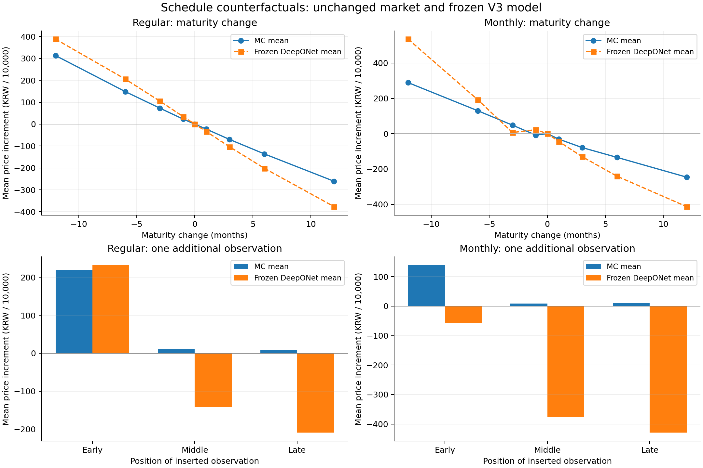

# Report 2 — 최종 MC·DeepONet·반사실 실험

## 1. 목적과 실험 단위

실제 상품은 쿠폰·배리어·행사가가 함께 달라져 한 조건만의 가격 효과를 관측값에서 분리하기 어렵다. 따라서 계약과 시장 상태를 명시하고 한 조건을 바꾼 합성 계약의 가격을 MC로 직접 계산했다. DeepONet의 `변경 후 예측 − 기준 예측`을 이 MC 차이와 비교한다. CatBoost로 관측되지 않은 가격을 추정한 결과가 아니며, 관측 공정가의 인과효과를 입증하는 실험도 아니다.

각 기준 계약과 모든 변경 계약은 동일한 시장 상태와 난수 경로를 공유한다. `ΔMC = mean(PV_changed − PV_base) × 10,000`. 표준오차도 경로별 차이의 분산으로 계산한다. 독립 가격 오차를 단순히 더하지 않는다. 서로 다른 MC 시드는 독립이며, 누적 경로 체크포인트는 독립 시드처럼 합산하지 않는다.

## 2. 데이터에서 계약으로

원문 `AUTO_CALL`, `SCHD_INFO`, `UDLY_INFO`와 당시 사용한 시장 스냅샷을 포함했다. `scripts/rebuild_source_inputs.py`는 KRW·3기초자산·STEP/LIZARD·낙인/노낙인, 관측 공정가/만기 범위, 평가 일정, 발행 전 시장 이력 조건으로 기존 58,790개 표본의 **상품 ID 집합**을 재확인한다. 여기서 공정가를 이용한 것은 기존 표본 정의를 재현하기 위한 필터이며, 새 학습 정답으로 사용하는 것이 아니다.

`prepare.py`는 해당 표본의 월지급형 7,791개를 원문 일정으로 감사한다. 그중 구현 스키마에 맞는 6,316개에서 월지급형 템플릿을 만들었다. 나머지는 제외 이유를 기록한다. 이것은 6,316개 상품의 개별 공시를 모두 검증했다는 뜻이 아니다. 공시 원문과 실제 지급 규칙을 개별 대조한 것은 월지급형 6개다.

공시 6개의 변동성·상관은 발행 전 최대 180거래일 로그수익률, 할인곡선은 발행 시점 KRW Nelson–Siegel 입력에서 다시 확인한다. 합성 학습·시험군의 시장 상태는 프로토콜의 분포에서 생성한다. 실제 상품을 그대로 재가격한 값과 계약 일정을 참고해 시장·쿠폰을 새로 만든 합성 가격을 구분한다.

기준 계약 2,652개는 학습 2,048개·검증 256개·시험 256개·진단 92개다. 학습/검증/시험은 일반형과 월지급형을 절반씩 포함한다. 진단 92개는 공시 6개와 이전 참고 계약 86개로, 새 독립 시험군이라고 주장하지 않는다. 이전 참고 계약에는 당시 명시한 합성 지급일 가정이 남아 있으므로 실제 발행사 가격으로 해석하지 않는다.

## 3. 최종 MC 계약 구현

`module/mc_contract_v3.py`는 일반형 구현인 `mc_contract_v2.py`를 확장한다. 최종 엔진과 가중치는 원래 검증한 파일을 그대로 보존했다.

| 항목 | 최종 계약 처리 |
|---|---|
| 평가·지급일 | 각각 명시적 일수 배열을 입력. 실제 공시 비교군은 원문 평가일을 사용 |
| 일반형 조기상환 | 해당 행사가 충족 시 원금+그 회차 약정 쿠폰, 명시 지급일 할인 |
| 리자드 | FROM_ISU 경로 최저가 조건과 회차별 지급액을 명시. 일반 상환과 우선순위를 구분 |
| 만기 낙인 미발생 | 계약에 명시된 원금+생존 쿠폰을 지급. 쿠폰을 묵시적으로 0으로 두지 않음 |
| 낙인/노낙인 | 낙인 조항 유무를 별도 변수로 구분. 만기 미상환 payoff와 일별 감시를 명시 |
| 월지급형 | 월 평가일의 지급 조건을 확인하여 월 지급일에 할인. 조기상환 후에는 새 쿠폰 권리가 발생하지 않음 |
| 월 쿠폰과 조기상환 | 동일 평가일 쿠폰 지급 여부를 계약 변수로 명시. 이미 발생한 지급 권리는 지급일이 상환 뒤여도 유지 |
| 중복 지급 방지 | 월지급형의 일반 누적·생존 쿠폰을 0으로 정의한 계약에서는 월 쿠폰과 다시 합산하지 않음 |
| 은행 지급일 | `holidays==0.104`의 한국 public+bank 휴일 목록 고정. 공시 6개는 개별 2/3영업일 규칙 적용 |

일반형 합성 지급일은 평가일 +1~5달력일, 이전 참고 실상품 조건 82개는 +2달력일 가정이다. 이를 실제 계약의 모든 영업일 지급 규칙을 복원한 것으로 부르지 않는다. 월지급형 합성의 2/3영업일 지연은 명시적으로 추출한 계약 조건이다.

시장은 발행 시점 3기초자산 worst-of GBM, 고정 변동성/상관, q=0, KRW NS 곡선, 일별 **달력 격자**다. 거래소별 세션·시장 중단·배당곡선·quanto/FX·변동성 스마일·local volatility·발행사 헤지/마진·발행 후 상태를 보정한 산업용 pricer는 아니다. 평균가격형·기억 쿠폰·발행사 콜·FROM_PREV 리자드 등은 지원을 추정하지 않고 제외한다.

## 4. 쿠폰·배리어·행사가 반사실 자료

쿠폰 ±0.1/0.25/0.5/1%p, 낙인 배리어·1차/만기 행사가·월 쿠폰 지급 배리어 ±0.5/1/2.5/5%p를 계산했다. KI가 없는 계약에는 KI 변경을 적용하지 않는다. 모든 기준·변경 조합은 85,440개다.

연 쿠폰을 바꾸면 정의된 이자기간을 통해 쿠폰 지급액도 함께 변한다. 쿠폰 숫자만 입력하고 payoff 지급액을 고정한 실험이 아니다. 월 쿠폰 지급 배리어는 KI 배리어와 다른 변수다. 만기 행사가도 KI 배리어와 구분한다.

학습·검증은 시드당 4만 경로 1시드, 시험·진단은 4만 경로 3시드다. 1만·2만·4만의 누적 체크포인트와 paired 표준오차를 저장했다. 일부 경계 계약에는 몇 원 이상의 MC 불확실성이 남으므로 MC 자체도 모든 경우에 1원 단위로 안정적이라고 주장하지 않는다.

## 5. Stage 1 DeepONet 학습

- 입력: NS 곡선 10차원, 변동성/상관/배당 9차원, 계약 일정·회차 마스크·쿠폰·월 쿠폰 배열 461차원. 자산을 정렬할 때 변동성·상관·배당을 함께 순열한다.
- 일반형은 최대 12회 상환, 월 쿠폰은 최대 60개를 표현한다. 관측 횟수만 변경하고 모델 입력이 그대로인 오류를 피하기 위해 날짜와 마스크를 포함한다.
- `augmented_price`: 합성 기준·변경 가격을 가격 손실로 학습.
- `augmented_delta`: 같은 데이터·구조에 가격+증분 손실을 적용.
- `affine_coupon_delta`: 가격+증분 손실과, 고정된 나머지 조건에서 쿠폰에 대해 선형·비음의 기울기를 갖는 구조를 사용. 쿠폰이 상환 조건을 바꾸지 않는 현재 payoff의 성질에 근거한다. 행사가·일정의 부호를 강제하지 않는다.
- 학습 시드 47·101·233, latent 128, family batch 128, Adam lr 0.0007, weight decay 1e-5, 최대 12,000스텝, 100스텝마다 검증, 15회 patience. 자세한 값은 `protocol.json`에 고정.
- 검증 점수 `price RMSE + 4 × delta RMSE`의 시드 평균으로 방식을 선택. 선택 방식은 `affine_coupon_delta`, 최종 예측은 그 3시드의 동일 가중 평균.

시험 데이터는 정규화·조기 종료·모델 선택에 사용하지 않았다. 월지급형은 쿠폰 값과 작은 날짜 차이를 제외한 구조 템플릿으로 그룹을 나누어 학습/검증/시험 간 중복을 막았다. PI-DeepONet을 추가한 결과가 아니며 Stage 2 잔차 모형도 사용하지 않았다.

## 6. 관측 횟수·만기 추가 실험

새 학습 없이 기존 모델을 고정하고 시험 계약 256개와 공시 6개에 3,003개 기준·변경 시나리오를 만들었다. 모든 시나리오는 시드당 4만 경로·3시드다. 계약별 최장 만기까지 공유 경로를 만들되 짧은 계약의 KI 감시에는 그 계약 만기까지만 사용한다.

### 관측 +1회

첫 평가 전·중간·마지막 두 평가 사이에 관측을 추가한다. 구간의 중간 일자를 사용하고 월지급형은 한국 은행 following으로 조정한다. 앞에 추가하면 기존 첫 행사가, 중간/뒤는 인접 행사가를 날짜에 따라 선형 보간한다. 일반형 쿠폰 이자기간도 인접 값으로 보간하고 새 리자드 조항은 넣지 않는다. 월지급형에서는 새 상환 평가만 추가하며 기존 월 쿠폰 일정은 유지한다.

기존 12회 일반형 47개는 추가하면 현재 최대 회차를 넘으므로 제외했다. 잘라내어 계산하지 않았다. 따라서 관측 +1회는 일반형 81개·월지급형 128개·공시 6개에서 평가했다.

### 만기 변경

±1/3/6/12개월을 적용한다. 연 쿠폰·행사가·배리어·상환 횟수는 유지한다.

- 일반형: 새 만기 일수 비율로 평가일과 쿠폰 이자기간을 조정한다. 지급 지연은 유지한다. 리자드 지급액도 같은 비율로 조정하여 기준의 연율을 유지한다.
- 월지급형: 최종 평가일을 달력 월 단위로 이동하고 은행 following을 적용한다. 중간 상환 일정은 비례 조정하며 개별 은행 지급 지연을 유지한다.
- 단축: 새 만기 이전 월 쿠폰은 유지한다. 원래 다음 월 쿠폰이 있고 새 만기가 그 전에 오면 그 회차의 지급률·배리어를 사용한 일할 stub을 추가한다. 존재하지 않은 지급 권리를 임의로 만들지 않는다.
- 연장: 기존 월 쿠폰을 모두 유지하고 원래 최종 평가일부터 월 단위 지급 회차를 추가한다. 마지막 원래 월 지급률·배리어를 사용하며 기존 누락 쿠폰을 소급해 채우지 않는다.

이는 하나의 계약상 만기 변경과 이에 종속되는 일정·현금흐름의 변화다. 만기만 숫자로 바꾸고 지급일·이자기간을 전부 고정한 것으로 설명하지 않는다. 새로 가정한 합성 조건이며 발행사에 확인받은 변경 견적은 아니다.

## 7. 구현 검증과 성능 판단

조건 변경 후 가격을 DeepONet으로 계산했다는 사실만으로 정확하다고 판단하지 않았다. 독립 현금흐름 원장과 MC 기준값을 확인한 다음 모델 오차를 계산했다.

- 결정적·경계 경로의 현금흐름, 공시 6개 × 3경로 지급 사례, 월 쿠폰/조기상환의 동시 처리, 월 쿠폰 없는 경우의 일반형 일치.
- 85,440개 입력 행의 계약 필드·시장 고정·정규화·baseline 연결, 최종 9개 모델 및 3개 앙상블 131,328행 재추론.
- 공시 6개 × 40,000경로의 824만 경로별 payoff를 독립 원장과 대조. 원래 감사에서 최대 차이는 약 8.9e-12원.
- 1차 행사가 증분이 양/음인 STEP no-KI 공시 2개를 독립 float64 NumPy GBM으로 재계산. 이 보조 시뮬레이터는 경로 의존 KI/리자드 검증용으로 확장해 해석하지 않는다.
- 일정 3,003개 × 12경로의 독립 원장 36,036건, 5,000경로 직접 참조 계산, 기존 엔진과 동일 날짜 계약 비교.

가격 MAE/RMSE/R², 증분 MAE/RMSE·편향, MC 오차로 구분 가능한 경우의 부호 일치율, 1/5/10원 이내 비율, 상품·변경 폭·MC 시드·학습 시드별 결과를 함께 본다. 평균 개선만으로 모든 계약에서 안정적이라고 결론 내리지 않는다. 실패를 부호에 맞추어 수정하지 않고 실제 관측 결과로 보존한다.

최종 수치는 [결과 보고서](docs/RESULTS.md)에 있다. 원문·프로토콜·모델·라벨 해시와 업로드 전 재현 범위는 [출처 및 재현 기록](provenance/README.md)에 있다.

## 최종 실험 결과 (2026-09-11까지)

아래 결과는 수정된 계약 현금흐름을 사용한 실제 실행 결과다. 과거 잘못된 MC 구현의 수치는 제외했다. **모든 원화 금액은 액면 10,000원 기준**이며, 실제 관측 공정가의 인과효과가 아니라 **정의된 MC 모형 안에서 계약조건을 변경한 반사실 가격 차이**다. 쿠폰·배리어·행사가 실험은 계약별 시장·일정·나머지 조건을 고정하고, 관측 횟수·만기 실험은 명시된 규칙에 따라 종속 일정과 쿠폰 이자기간도 조정했다.

### 완료된 실행 범위

- 계약조건 실험: 기준 계약 2,652개, 기준·변경 시나리오 85,440개. 학습 2,048개 / 검증 256개 / 시험 256개 / 진단 92개(공시 확인 월지급형 6개 + 이전 참고 계약 86개).
- 일반형·월지급형 각각 시험 128개. 월지급형은 계약 템플릿 그룹을 분리하고 공시 비교군의 템플릿도 학습에서 제외했다.
- MC는 **시드당 40,000경로**. 학습·검증은 1시드, 시험·진단은 3개 독립 시드(계약당 합계 120,000경로). 10,000→20,000→40,000은 같은 실행의 누적 체크포인트다.
- 세 학습 방식 × 학습 시드 47·101·233 = 9개 DeepONet. 모델 선택은 검증 자료로 끝냈고 선택 방식의 3시드 평균을 사용했다. PI 손실과 Stage 2는 사용하지 않았다.
- 관측 횟수·만기 추가 평가: 기존 시험 256개 + 공시 6개, 총 262개 기준 계약·3,003개 시나리오. 모든 계약에 40,000경로 × 3시드. 위의 9개 모델을 재학습 없이 평가했다. 이미 살펴본 시험군의 진단 확장이므로 새 독립 최종시험이라고 부르지 않는다.

### 조건별 MC 가격 변화

계약별 증분의 단순평균이다. 가격 변화량과 예측 오차는 서로 다른 수치다.

| 변경 조건 | 일반형 평균 ΔMC | 월지급형 평균 ΔMC |
|---|---|---|
| 연 쿠폰 +1%p | +56.29원 (128개) | +100.50원 (128개) |
| 낙인 배리어 +5%p | -67.82원 (64개) | -70.90원 (43개) |
| 1차 행사가 +5%p | -86.77원 (128개) | -49.60원 (128개) |
| 만기 행사가 +5%p | -40.56원 (128개) | -52.80원 (128개) |
| 월 쿠폰 지급 배리어 +5%p | 해당 없음 | -67.07원 (128개) |

쿠폰 증가의 양(+) 효과와 KI 배리어 증가의 음(-) 효과를 확인했다. 1차 행사가의 평균 효과는 음(-)이지만 양(+)인 계약도 있다. 원금 회수 시점과 추가 쿠폰 지급이 함께 달라지므로 행사가 변화의 방향을 학습 결과에 강제로 맞추지 않았다.

### DeepONet의 가격·증분 예측 성능

아래 가격 지표는 시험 계약의 기준·변경 가격 전체, 증분 지표는 변경 시나리오에서 계산했다. 각 행은 해당 방식의 3개 학습 시드 평균 예측이다. 방향 일치율은 |ΔMC| > 1.96 × paired MC SE이면서 영향 경로가 30개 이상인 경우만 평가했다.

| 상품 | 학습 방식 | 가격 R² | 가격 MAE(원) | 증분 MAE(원) | MC 방향 일치율 |
|---|---|---|---|---|---|
| 일반형 | 합성 가격 손실 | 0.9509 | 88.95 | 14.92 | 98.84% |
| 일반형 | 가격 + 증분 손실 | 0.9612 | 79.15 | 8.92 | 98.89% |
| 일반형 | 가격 + 증분 손실 + 쿠폰 선형 구조 (선택) | 0.9703 | 64.84 | 7.43 | 98.37% |
| 월지급형 | 합성 가격 손실 | 0.9153 | 103.33 | 11.70 | 99.26% |
| 월지급형 | 가격 + 증분 손실 | 0.9019 | 114.77 | 6.19 | 99.19% |
| 월지급형 | 가격 + 증분 손실 + 쿠폰 선형 구조 (선택) | 0.9224 | 92.25 | 6.41 | 95.08% |

같은 합성 데이터에서 가격만 학습한 경우보다 선택 모델의 평균 증분 오차는 일반형 **14.92→7.43원**, 월지급형 **11.70→6.41원**으로 감소했다. 월지급형 증분 MAE만 보면 가격+증분 손실 모델(6.19원)이 선택 모델보다 작다. 선택은 전체 검증 점수로 결정했으며 시험 결과에 따라 바꾸지 않았다. 이 실험에는 새로운 데이터의 기준 가격만 학습한 별도 대조군이 없어, 합성 자료 추가 효과를 손실 변경 효과와 독립적으로 입증한 것은 아니다.

### 관측 횟수·만기 변경에 대한 추가 평가

관측 +1회의 위치별 정의와 만기 변경에 따른 지급·이자기간 규칙은 [실험 과정](docs/EXPERIMENT.md)에 설명했다. 관측 +1회는 기존 12회 계약을 제외하여 일반형 81개·월지급형 128개에서, 만기 변경은 각각 128개에서 평가했다. 공시 6개는 별도 진단 결과 파일에 포함되어 있다.

| 변경 조건 | 일반형 평균 ΔMC(원) | 일반형 증분 MAE(원) | 월지급형 평균 ΔMC(원) | 월지급형 증분 MAE(원) |
|---|---|---|---|---|
| 관측 +1회: 첫 평가 전 | +219.95 | 94.49 | +139.08 | 205.61 |
| 관측 +1회: 중간 | +11.25 | 234.60 | +8.82 | 384.78 |
| 관측 +1회: 마지막 구간 | +8.09 | 243.36 | +9.66 | 439.06 |
| 만기 -12개월 | +313.19 | 251.99 | +289.23 | 304.48 |
| 만기 -6개월 | +148.83 | 140.81 | +130.02 | 128.06 |
| 만기 -3개월 | +72.70 | 72.33 | +48.04 | 53.96 |
| 만기 -1개월 | +23.08 | 23.77 | -8.02 | 34.31 |
| 만기 +1개월 | -22.97 | 24.05 | -31.34 | 17.07 |
| 만기 +3개월 | -70.05 | 72.43 | -78.87 | 54.29 |
| 만기 +6개월 | -136.14 | 141.28 | -134.31 | 110.65 |
| 만기 +12개월 | -260.90 | 261.98 | -246.37 | 178.06 |

### 결론과 남은 실패

**일부 축의 평균 증분 오차는 개선됐지만, 모든 계약조건 변화에서 가격 증분을 안정적으로 예측한다는 결과는 아니다.**

- 공시 확인 월지급형 32410의 1차 행사가 +5%p: MC **−9.55원**, 선택 DeepONet **+9.44원**으로 방향이 달랐다. 독립 NumPy MC에서도 **−9.51원**을 확인했다.
- 월지급형에서 관측을 중간·마지막 구간에 1회 추가하면 MC는 평균 **+8.82원·+9.66원**, 모델은 **−375.97원·−429.40원**을 예측했다. 평균 증분 오차는 **384.78원·439.06원**이다.
- 일정 추가 실험은 동일 가중치의 새로운 평가 축이므로, 앞의 6.41원과 직접 비교해 학습 후 성능이 퇴보했다고 해석하지 않는다. 학습 표본에 부족한 일정에 대한 일반화 실패가 확인된 것이다. 분포 부족만이 유일한 원인이라고 입증한 것은 아니다.
- 독립 현금흐름 계산·입력/정규화·모델 재추론을 점검했지만 산업용 pricer 전체 검증을 완료했다는 뜻은 아니다. 현재 GBM·역사 변동성/상관·q=0·일별 달력 격자 가정에 따른 모형 오차가 남는다.
- 가격 R²도 0.9999에 도달하지 않았다. 1/5/10원 이내 비율은 진단 기준이며 회사가 승인한 허용오차가 아니다. **실무에서 원하는 가격 정확도와 증분 안정성을 달성했다고 결론 내릴 수 없다.**
