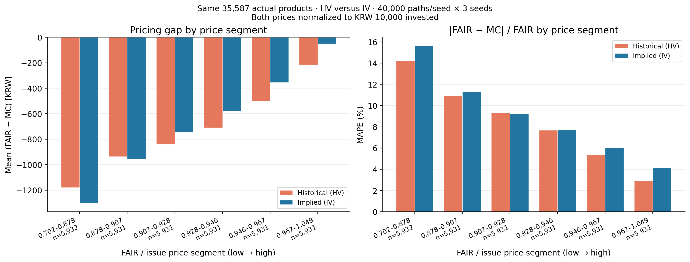

# 동일 상품의 HV·IV MC 공정가 구간별 비교

동일한 실상품 **35,587개**에서 변동성 입력만 역사적 변동성(HV)과 내재변동성(IV)으로 바꾸어 공정가와 비교했습니다.
원문 계약, 평가·지급 일정, 상관계수, 금리곡선, 배당률, 난수 시드, 경로 수, 정규화 기준은 동일합니다.
완료된 IV 계산값은 그대로 재사용하고 부족했던 HV 가격만 추가로 계산했습니다. DeepONet은 이 분석에 사용하지 않았습니다.



| 공정가 구간 | 상품 수 | HV 평균 FAIR−MC(원) | IV 평균 FAIR−MC(원) | HV MAPE(%) | IV MAPE(%) |
| --- | --- | --- | --- | --- | --- |
| 0.702–0.878 | 5932 | -1,179.04 | -1,303.91 | 14.22 | 15.65 |
| 0.878–0.907 | 5931 | -935.18 | -956.61 | 10.90 | 11.34 |
| 0.907–0.928 | 5931 | -841.36 | -745.76 | 9.35 | 9.27 |
| 0.928–0.946 | 5931 | -708.26 | -580.26 | 7.68 | 7.70 |
| 0.946–0.967 | 5931 | -500.47 | -354.18 | 5.37 | 6.05 |
| 0.967–1.049 | 5931 | -214.76 | -51.64 | 2.90 | 4.15 |


전체 평균 FAIR−MC는 HV **-729.86원**, IV **-665.41원**입니다.
전체 MAPE는 HV **8.40%**, IV **9.03%**로,
IV 적용 시 **0.62%p 증가**했습니다.
6개 구간 중 IV MAPE가 낮은 구간은 **1개**이고,
상품별 절대 가격 차이가 줄어든 비율은 **42.21%**입니다.

평균 절대 가격 차이(MAE)는 HV **759.23원**, IV **816.62원**입니다.
부호가 있는 평균 FAIR−MC는 양수·음수 차이가 상쇄될 수 있으므로, 그 값이 0에 가까워졌다는 사실만으로 오차 개선을 판단하지 않습니다.
4만 경로의 개별 3개 시드에서도 IV−HV MAPE 변화는 **+0.6218~+0.6229%p**였습니다.

이 수치는 관측 공정가에 대한 MC 가격의 차이이며, DeepONet의 예측오차 또는 검증된 시장 정답에 대한 오차는 아닙니다.
IV와 HV 중 어느 쪽이 공정가에 가까운지와 실무 가격모형으로서 어느 쪽이 타당한지는 구분해서 해석해야 합니다.

## 계산 기준

- 시드당 **40,000경로 × 3개 시드**. HV·IV 모두 같은 난수 시드와 경로 분할을 사용했습니다.
- HV는 기존 `module/features.py`의 `vol180`을 사용했습니다. 발행일보다 앞선 180개 로그수익률의 표본표준편차 × √252이며, 이번 표본에는 모두 180개가 존재합니다.
- IV는 앞서 적용한 발행일 당일 또는 이전 최신 ATM IV이며 최대 7달력일 이내입니다. 단일 변동성이고 기간구조·스마일은 없습니다.
- 각 상품의 공정가·HV MC·IV MC 모두 같은 실제 발행가로 나눴습니다. 왼쪽 금액은 다시 10,000을 곱해 발행금액 1만 원 기준으로 표시했습니다.
- `pd.qcut(FAIR/발행가, 6)`으로 같은 6분위 구간을 두 군에 적용했습니다.
- 왼쪽: 구간 내 평균 `(fair − mc) × 10,000`. 오른쪽: 구간 내 평균 `abs(fair − mc) / abs(fair) × 100`.
- 같은 표본과 구간을 사용하므로 IV 막대는 [기존 IV 단독 분석](../fair_mc_iv_population_20260914/REPORT.md)의 수치와 같습니다.
- 지급일 추정, 액면 10,000원 가정, 개별 공시 대조 6개라는 범위와 공정가·MC 기준일 차이 가능성도 기존 분석과 동일합니다.
- 두 군의 경로별 교차곱은 저장하지 않았으므로 paired pathwise 표준오차를 산출했다고 주장하지 않습니다. 시드별 비교값을 별도로 저장했습니다.

HV의 3시드 평균 가격에서 2만→4만 경로 평균 절대 변화는 액면 기준 **2.73원**입니다.

## 저장 파일과 재현

- `prepare.py`: 기존 IV 표본과 계약을 고정하고 HV 입력만 추가합니다.
- `run.py`: 기존 IV 실행 코드의 MC 호출을 재사용해 HV만 계산하며 동일 시드를 검증합니다.
- `report.py`: 동일 6분위의 그림·표·해설을 저장된 계산값에서 생성합니다.
- `results/fair_mc_hv_iv.csv`: 상품별 공정가와 두 MC 가격, 가격 차이 및 상대오차.
- `results/volatility_assignment.csv`: 시장군·기초자산별 HV, IV, HV 수익률 기간.
- `results/seed_checkpoints_hv_iv.csv.gz`: 상품·시드·경로 수별 두 군의 원시 합계·제곱합과 가격 차이.
- `results/seed_summary.csv`: 3개 시드와 1만/2만/4만 경로별 집계. 본문의 3시드 평균 가격 기준 집계와 구별합니다.
- `results/price_segments_hv_iv.csv`: 그림의 정확한 막대값.
- `results/pre_mc_verification.json`, `results/verification.json`: 동일 시드, 기존 IV 재계산 일치, 계약 엔진·정규화·구간별 검증.
- `figures/`: PNG, SVG, PDF. STEP KI 10,002개만의 비교도 별도 저장했습니다.

기존 IV 분석이 완료된 저장소에서 실행합니다. `requirements.txt`의 의존성이 필요합니다.
이번 실행은 Python 3.11 / PyTorch 2.9.1 CPU 환경입니다.

```bash
python scripts/restore_artifacts.py
python analysis/fair_mc_hv_iv_population_20260914/prepare.py
python analysis/fair_mc_hv_iv_population_20260914/run.py --workers 48
python analysis/fair_mc_hv_iv_population_20260914/report.py
```

계산된 결과로 그림만 다시 만들 때는 마지막 `report.py`만 실행합니다.
