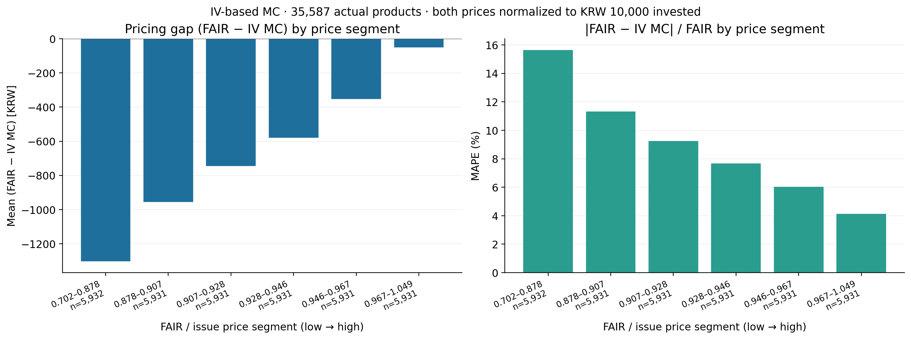
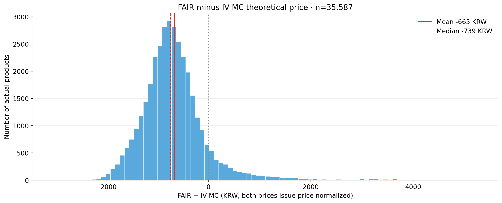
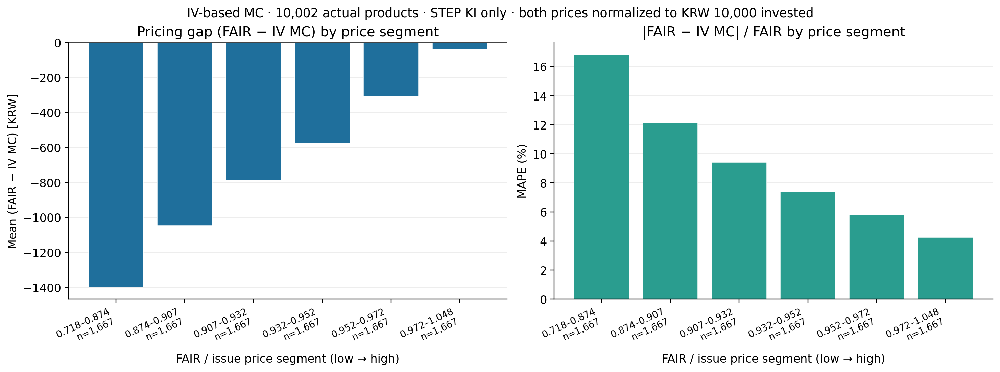

# IV MC와 공정가의 가격구간별 분석

현재 IV 브랜치의 MC 엔진으로 실제 상품 35,587개의 원계약 가격을 계산하고,
동일 상품의 공시 공정가와 비교했습니다. MC 입력은 ATM IV이며, HV 모델이나 DeepONet 예측값을 섞지 않았습니다.
합성 계약의 조건 변경 실험과 별개로, 이 분석에는 변경 전 원계약만 포함합니다.

## 계산과 그림

- 발행가 정규화: `fair = 원문 FAIR_VALUE / 실제 발행가`, `mc_iv = 액면 10,000원 MC 가격 / 실제 발행가`.
- 차이(원): `(fair − mc_iv) × 10,000`. 두 값 모두 같은 발행금액 기준입니다.
- 상대오차(%): `abs(fair − mc_iv) / abs(fair) × 100`.
- 공정가를 `pd.qcut(fair, 6)`으로 6분위로 나누어 각 구간의 평균 차이와 평균 상대오차를 그렸습니다.
  구간당 상품 수가 비슷하며 가격 구간의 폭은 서로 다릅니다.
- 히스토그램은 상품별 차이를 90개 bin으로 집계하고 평균·중앙값을 표시합니다.
- 상품별 시드당 40,000경로 × 3개 시드. 동일 시장·발행일의 상품끼리는 경로를 재사용하되,
  각 상품의 관측일·지급일·만기·지급조건은 별도로 적용했습니다.



| 공정가 구간 | 상품 수 | 평균 FAIR−MC(원) | MAPE(%) |
| --- | --- | --- | --- |
| 0.702–0.878 | 5932 | -1,303.91 | 15.65 |
| 0.878–0.907 | 5931 | -956.61 | 11.34 |
| 0.907–0.928 | 5931 | -745.76 | 9.27 |
| 0.928–0.946 | 5931 | -580.26 | 7.70 |
| 0.946–0.967 | 5931 | -354.18 | 6.05 |
| 0.967–1.049 | 5931 | -51.64 | 4.15 |




평균 차이는 **-665.41원**, 중앙값은 **-738.60원**,
전체 MAPE는 **9.03%**입니다.
가장 낮은 공정가 구간의 MAPE는 15.65%, 가장 높은 구간은 4.15%입니다.
6개 구간에서 MAPE가 순서대로 모두 감소했는지: **True**.
음의 FAIR−MC는 MC 가격이 공시 공정가보다 높다는 뜻입니다. 이 수치는 DeepONet 예측오차가 아닙니다.

## 분석 대상과 제외

원래 표본 ID 58,790개 중 35,587개를 계산했고 23,203개를 제외했습니다.
선택은 MC 결과를 보기 전에 원문 필드와 IV 존재 여부로 결정했습니다. 상품별 사유는 results/excluded_products.csv에 있습니다.

| 사유 | 건수 |
| --- | --- |
| iv_before_history | 10900 |
| missing_explicit_survival_coupon | 4780 |
| payment_lag_not_identifiable_from_maturity | 3355 |
| iv_missing_series | 2318 |
| extra_formula_or_level_PMT_1_FRML | 733 |
| unsupported_ki_window | 578 |
| unsupported_PRCP_GRTE_RT | 168 |
| extra_formula_or_level_PMT_EXTRA | 99 |
| averaging_not_supported | 84 |
| extra_formula_or_level_STRK_2 | 61 |
| monthly_evaluation_outside_life | 43 |
| iv_stale | 36 |
| second_maturity_payment_without_ki | 21 |
| invalid_evaluation_dates | 13 |
| missing_schedule_values | 8 |
| unsupported_redemption_structure | 3 |
| nonterminal_second_payment | 3 |


| 구조 | 월지급 | 건수 |
| --- | --- | --- |
| LIZARD KI | False | 1401 |
| LIZARD no-KI | False | 7831 |
| LIZARD no-KI | True | 110 |
| STEP KI | False | 10001 |
| STEP KI | True | 1 |
| STEP no-KI | False | 12663 |
| STEP no-KI | True | 3580 |


개별 공시 대조까지 한 상품은 6개이며, 나머지는 원문 데이터의 일정·지급률을 사용한 모형 진단입니다.
공시 전문을 전량 대조한 가격이라는 뜻은 아닙니다.

## 적용 가정과 범위

1. IV는 각 기초자산의 발행일 이전 또는 당일 최신 관측값을 사용하고, 7일 초과 또는 하나라도 누락되면 제외했습니다.
   역사적 변동성을 IV 대신 채우지 않았습니다. 상관계수는 발행 전 180개 정렬 수익률, 금리는 기존 KRW NS 곡선입니다.
2. 기존 V2/V3 지급 엔진과 V4 공통경로 수집 코드를 그대로 호출했습니다. 만기 생존 쿠폰은 원문 PMT_2로,
   월 쿠폰은 별도 일정의 PMT_1로 구성했습니다. 추정되지 않는 추가 지급식·평균가격·미지원 조건은 제외했습니다.
3. 공시 대조 상품 이외의 지급일은 마지막 평가일→원문 만기일에 맞는 유일한 1~5 은행영업일 지연을 구하고,
   동일 지연을 다른 지급일에도 적용했습니다. 상품별 약관으로 모두 확정한 지급 규칙은 아닙니다.
4. 액면 10,000원을 가정하고 발행가 9,000~10,000원 상품을 포함했습니다. 개별 공시 대조 상품 외에는 액면을 전량 대조하지 않았습니다.
   발행가 정규화는 FAIR와 MC 모두에 동일하게 적용했습니다.
5. GBM·일별 모니터링·배당률 0·단일 ATM IV 가정은 IV 브랜치와 같습니다. 변동성 표면·만기구조·quanto 보정은 없습니다.
6. 공시 FAIR 기준일과 MC에 사용한 발행일 시장자료가 다를 수 있습니다. 따라서 관측 차이 전체를 MC 오류나 한 요인의 인과효과로 해석하지 않습니다.

3개 시드 평균 MC의 2만→4만 경로 평균 절대 가격 변화는 액면 기준 2.80원입니다.
상품별 MC 표준오차의 중앙값은 2.97원, 95분위는 7.90원입니다.

## 재현 파일

- prepare.py: 원문 계약과 시장자료 연결, 사전 제외 기준, protocol.json과 입력 해시 생성.
- run.py: 고정 MC 엔진 호출, 3개 시드 및 1만/2만/4만 체크포인트, 중단 후 동일 작업 재개.
- report.py: FAIR 6분위 집계, 히스토그램과 현재 문서 생성.
- results/fair_mc_iv.csv: 상품별 FAIR, IV MC, 차이, 상대오차.
- results/price_segments.csv: 그림의 6개 막대에 대응하는 정확한 집계값.
- results/mc_seed_checkpoints.csv.gz: 상품·시드·경로 수별 원시 합계와 제곱합.

저장소 최상위에서 기존 Python 의존성을 설치한 환경으로 실행합니다. 앞의 두 명령은 저장된 원문 자료와 IV ZIP을 복원합니다. 이미 계산된 결과로 그림만 다시 만들려면 `report.py`만 실행하면 됩니다.

```bash
python scripts/restore_artifacts.py
python analysis/iv_validation_20260914/restore_input.py
python analysis/fair_mc_iv_population_20260914/prepare.py
python analysis/fair_mc_iv_population_20260914/run.py --workers 16
python analysis/fair_mc_iv_population_20260914/report.py
python analysis/fair_mc_iv_population_20260914/verify_results.py
```

STEP KI에 한정한 10,002개 표본의 동일 집계도 별도로 저장했습니다.


