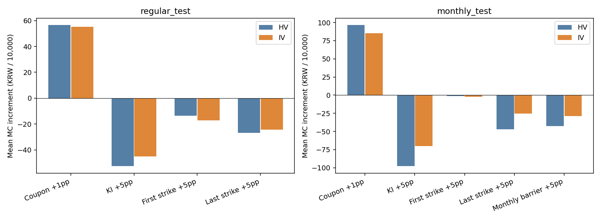
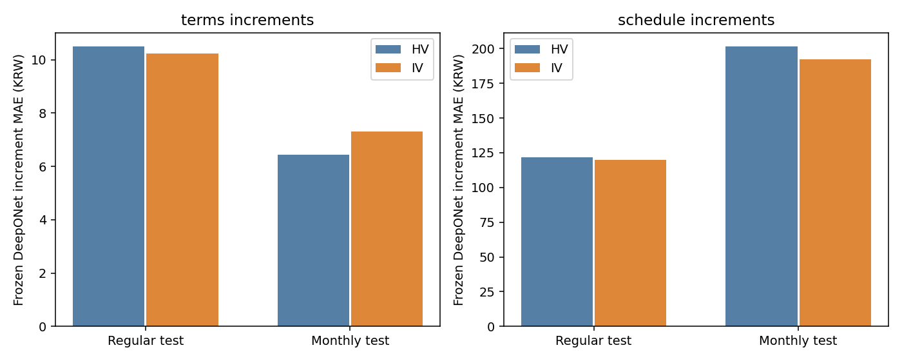

# ATM IV 적용 MC 가격·증분 및 고정 DeepONet 검증

예측 타깃은 MC 이론가다. 관측 공정가 학습, Stage 2 잔차 모델, PI 손실, 신규 모델 학습은 사용하지 않았다. 기존 계약 구현과 9개 DeepONet 가중치를 보존하고 시장 입력을 변경한 평가다.

## 데이터와 비교 설계

첨부 ZIP의 2,404개 CSV, 247,586개 행, 123개 notion RIC를 확인했다. 기간은 2017-01-03~2026-08-07다. 파일은 `calc_date/notion_ric/source_ric/iv`만 포함하며 옵션 만기 정보는 없다. IV는 소수 연율로 해석하고 기초자산별 고정 ATM 변동성으로 사용했다. 기간구조나 스마일을 복원한 실험은 아니다.

기존 262개 시험·공시 계약 중 236개를 포함하고 26개 월지급형 시험 계약을 제외했다. 세 자산의 발행일 이전 또는 당일 IV가 모두 있어야 하며 최대 7달력일 이내 값만 허용했다. 제외는 IV 이력 시작 전 발행 또는 미확보 자산 때문이며 상세 사유를 CSV에 기록했다. IV 미확보 부분을 역사적 변동성으로 대체하지 않았다.

일반형 시험 계약 128개에는 적격 실상품에서 사전 고정 난수로 뽑은 자산·발행일의 시장 상태를 부여했다. 월지급형 시험 계약은 원래 일정 템플릿의 자산·발행일을 사용했다. 두 경우 모두 기존 합성 계약의 지급 규칙을 유지한다. 시장 상태를 제공한 실상품의 공정가를 합성 계약의 실제 가격으로 사용하지 않았다. 공시 6개는 원래 자산·발행일과 검증된 계약을 유지했다.

HV와 IV 두 군은 변동성만 다르다. HV는 발행 전 최대 180거래일 로그수익률의 연율 표준편차이고, 두 군의 상관계수는 동일한 역사적 상관이다. 금리·NS 방식·q=0·계약·난수·지급 일정은 동일하다. 날짜 단위 as-of이며 개별 데이터의 장중 가용 시각 또는 FRED 공표 빈티지를 검증한 것은 아니다.

**이 HV군은 이전 합성 시험의 임의 시장 상태를 그대로 재사용한 군이 아니다. 이번에 구성한 실제 시장 상태의 HV/IV 쌍이다. 이전 Report_2 평균과 이번 IV 평균의 차이를 IV 단독 효과로 해석하지 않는다.**

| 평가군 | 변동성 | 계약 수 | 학습 변동성 범위 밖 계약 | 최소 σ(%) | 최대 σ(%) |
|---|---|---|---|---|---|
| 일반형 시험 | HV | 128 | 20 | 6.66 | 42.82 |
| 일반형 시험 | IV | 128 | 65 | 5.10 | 72.31 |
| 월지급형 시험 | HV | 102 | 12 | 6.78 | 36.97 |
| 월지급형 시험 | IV | 102 | 27 | 5.30 | 60.68 |
| 공시 월지급형 | HV | 6 | 0 | 12.88 | 34.92 |
| 공시 월지급형 | IV | 6 | 1 | 10.94 | 27.76 |

범위 밖은 적어도 한 자산의 σ가 기존 합성 학습 범위 12~45% 밖이라는 뜻이다. 다른 입력의 분포 차이까지 판정한 지표는 아니다. 원본에는 IV>300%인 행도 있으나 이번 선정 시장의 최대 IV는 위 표와 같으며, 수치에 맞추는 clipping은 하지 않았다.

## MC 계산과 계약 변경

각 군 9,907개 기준·변경 시나리오, 시드당 40,000경로×3시드다. 10,000/20,000/40,000경로는 누적 체크포인트다. HV와 IV, 기준과 변경 계약에 같은 표준정규 난수를 사용했다. 각 가격과 증분뿐 아니라 IV−HV 가격·증분 차이의 paired 표준오차도 저장했다.

쿠폰 ±0.1/0.25/0.5/1%p, KI·1차/만기 행사가·월 지급 배리어 ±0.5/1/2.5/5%p와 기존 일정 실험의 관측 추가 3위치·만기 ±1/3/6/12개월을 포함했다. 관측 추가와 만기 변경의 일정·이자기간 규칙은 기존 V4 계약을 그대로 읽었다. 월 쿠폰 지급 배리어와 KI는 별개다. 만기를 바꿔도 이번에는 단일 IV 값을 고정한다.

## MC 조건별 가격 증분

표의 값은 같은 군 안에서 `변경 계약 MC − 기준 계약 MC`를 먼저 구한 뒤 계약별로 평균한 원 단위 값이다. 액면 10,000원 기준이다.

| 평가군 | 변경 | 계약 수 | HV 증분 | IV 증분 | IV−HV 증분 |
|---|---|---|---|---|---|
| 일반형 시험 | 연 쿠폰 +1%p | 128 | 56.49 | 55.27 | -1.21 |
| 일반형 시험 | 낙인 배리어 +5%p | 64 | -52.67 | -45.14 | 7.54 |
| 일반형 시험 | 1차 행사가 +5%p | 128 | -13.65 | -17.32 | -3.67 |
| 일반형 시험 | 만기 행사가 +5%p | 128 | -26.88 | -24.42 | 2.46 |
| 일반형 시험 | 첫 평가 전 관측 추가 +1회 | 81 | 29.27 | 46.90 | 17.63 |
| 일반형 시험 | 중간 관측 추가 +1회 | 81 | 3.12 | 3.93 | 0.81 |
| 일반형 시험 | 마지막 구간 관측 추가 +1회 | 81 | 2.21 | 2.95 | 0.74 |
| 일반형 시험 | 만기 +6개월 | 128 | -32.87 | -34.11 | -1.24 |
| 월지급형 시험 | 연 쿠폰 +1%p | 102 | 96.43 | 85.43 | -11.00 |
| 월지급형 시험 | 낙인 배리어 +5%p | 21 | -97.84 | -70.07 | 27.77 |
| 월지급형 시험 | 1차 행사가 +5%p | 102 | -1.47 | -1.99 | -0.51 |
| 월지급형 시험 | 만기 행사가 +5%p | 102 | -46.75 | -25.50 | 21.25 |
| 월지급형 시험 | 월 쿠폰 지급 배리어 +5%p | 102 | -42.59 | -28.85 | 13.74 |
| 월지급형 시험 | 첫 평가 전 관측 추가 +1회 | 102 | -35.77 | -51.92 | -16.15 |
| 월지급형 시험 | 중간 관측 추가 +1회 | 102 | 0.31 | 1.35 | 1.04 |
| 월지급형 시험 | 마지막 구간 관측 추가 +1회 | 102 | 2.57 | 2.88 | 0.31 |
| 월지급형 시험 | 만기 +6개월 | 102 | -37.77 | -14.42 | 23.35 |

전체 변경 폭, 계약별 부호, 범위 및 MC 불확실성은 `results/mc_effect_summary.csv`와 `results/mc_labels.csv`에 있다. 평균 증분은 모든 계약의 동일 부호를 뜻하지 않는다. 1차 행사가·일정 변경의 방향을 임의로 강제하지 않았다.

## 고정 DeepONet 평가

기존 3개 학습 방식×3개 시드를 모두 평가했다. 대표 결과는 이전 검증군에서 이미 선택된 `affine_coupon_delta` 3시드 평균이며 이번 IV 결과로 모델을 다시 선택하지 않았다. 두 군 모두 해당 군의 변동성을 모델 입력과 MC 입력에 동일하게 적용했다.

| 평가군 | 증분 종류 | 입력 | 증분 MAE(원) | RMSE(원) | 구분 가능한 부호 일치 | 5원 이내 |
|---|---|---|---|---|---|---|
| 일반형 시험 | 계약조건 | HV | 10.49 | 19.37 | 93.9% | 53.4% |
| 일반형 시험 | 계약조건 | IV | 10.22 | 18.14 | 93.4% | 52.6% |
| 일반형 시험 | 관측·만기 | HV | 121.58 | 195.47 | 62.2% | 6.2% |
| 일반형 시험 | 관측·만기 | IV | 120.00 | 192.99 | 63.2% | 5.5% |
| 월지급형 시험 | 계약조건 | HV | 6.43 | 11.97 | 98.1% | 65.4% |
| 월지급형 시험 | 계약조건 | IV | 7.32 | 13.12 | 98.8% | 62.1% |
| 월지급형 시험 | 관측·만기 | HV | 201.32 | 271.18 | 71.3% | 1.1% |
| 월지급형 시험 | 관측·만기 | IV | 192.35 | 250.59 | 52.9% | 1.5% |
| 공시 월지급형 | 계약조건 | HV | 3.72 | 6.20 | 96.9% | 78.0% |
| 공시 월지급형 | 계약조건 | IV | 5.58 | 8.78 | 96.9% | 66.5% |
| 공시 월지급형 | 관측·만기 | HV | 210.86 | 280.43 | 65.1% | 0.0% |
| 공시 월지급형 | 관측·만기 | IV | 204.68 | 265.20 | 68.8% | 1.5% |

부호 일치율은 |MC 증분|>1.96×paired SE이고 영향받은 경로가 30개 이상인 경우만 계산한다. 군별로 이 분모가 달라질 수 있으므로 MAE와 함께 본다. 가격 수준의 R²만으로 증분 안정성을 판단하지 않는다.

## 결과 해석

- 일반형 시험의 쿠폰·배리어·행사가 증분 MAE는 HV 10.49원 → IV 10.22원으로 감소했다. 이 값은 같은 계약 표본의 고정 모델 비교다.

- 일반형 시험의 관측·만기 증분 MAE는 HV 121.58원 → IV 120.00원으로 감소했다. 이 값은 같은 계약 표본의 고정 모델 비교다.

- 월지급형 시험의 쿠폰·배리어·행사가 증분 MAE는 HV 6.43원 → IV 7.32원으로 증가했다. 이 값은 같은 계약 표본의 고정 모델 비교다.

- 월지급형 시험의 관측·만기 증분 MAE는 HV 201.32원 → IV 192.35원으로 감소했다. 이 값은 같은 계약 표본의 고정 모델 비교다.

기준 계약의 가격 수준 성능:

| 평가군 | 입력 | 가격 MAE(원) | RMSE(원) | R² |
|---|---|---|---|---|
| 일반형 시험 | HV | 100.30 | 136.59 | 0.9209 |
| 일반형 시험 | IV | 106.83 | 162.58 | 0.9133 |
| 월지급형 시험 | HV | 110.37 | 125.59 | 0.6710 |
| 월지급형 시험 | IV | 101.92 | 118.39 | 0.9185 |
| 공시 월지급형 | HV | 72.57 | 87.12 | 0.9274 |
| 공시 월지급형 | IV | 58.77 | 65.71 | 0.9086 |

IV를 적용했을 때 MC 가격이 달라진 것과 DeepONet의 근사 오차가 개선된 것은 별개의 결과다. 본 실험은 ATM IV 입력에서도 기존 모델이 기준 MC를 근사하는지 평가했으며, 실무 견적 가격의 정확성이나 모든 계약에서의 안정성을 입증한 것은 아니다. 변동성 범위 밖 계약 및 모델별·시드별 차이는 별도 CSV로 보존했다.

## MC 자체의 수치 불확실성

| 평가군 | 입력 | 95% 반폭 중앙값(원) | 최대 반폭(원) | 부호 구분 가능 비율 |
|---|---|---|---|---|
| 일반형 시험 | HV | 0.93 | 15.37 | 86.7% |
| 일반형 시험 | IV | 0.88 | 18.87 | 87.0% |
| 월지급형 시험 | HV | 0.76 | 8.91 | 92.5% |
| 월지급형 시험 | IV | 0.51 | 13.21 | 95.9% |

95% 반폭은 각 증분 MC 추정치의 정규근사 수치 불확실성이다. 상품 모집단의 신뢰구간이나 모델 위험의 범위가 아니다. 계약별 경계 사건에서는 불확실성이 커질 수 있으므로 단일 방향 불일치만으로 구현 오류를 단정하지 않는다.

## 검증과 재현

- 신규 paired 계산기를 기존 V4 엔진과 일반형 1개·월지급형 1개의 모든 변경 시나리오에서 각 500경로로 비교했고 합계 오차는 0이었다. HV=IV이면 가격·증분 차이와 그 분산이 정확히 0이었다.

- 공시 6개의 새 HV 시장 입력을 기존 공시 실험의 시장 입력과 대조했고 1e-12 이내로 일치했다.

- 계약 변경·시장 고정·IV as-of·세 시드·현금흐름 분해·가격 차이와 증분의 일치 및 쿠폰 선형성을 확인했다.

- 기존 MC 엔진, 입력 인코더, 학습 자료와 9개 모델 가중치의 해시가 변경되지 않았음을 확인했다.

- `protocol.json`, `results/input_audit.json`, `results/pre_mc_verification.json`, `results/post_run_verification.json`에 설정과 검증을 저장했다. 실행 방법은 이 폴더의 README를 참조한다.

- 모델별로 144개 가격·증분 쌍을 따로 인코딩해 저장 결과와 대조했다. 작은 배치와 원래 큰 배치의 최대 차이는 0.001192원이었다. 입력 연결 오류와 모델의 예측 오차를 구분하기 위한 확인이다.

MC 이론가가 최종 예측 타깃인 방향을 유지한다. 이후 학습을 추가한다면 현재 평가와 분리된 학습·검증 계약 및 시장 상태를 구성하고, 독립 시험에서 가격·증분 오차를 다시 확인해야 한다.
