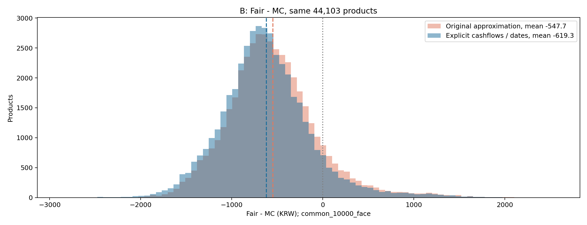
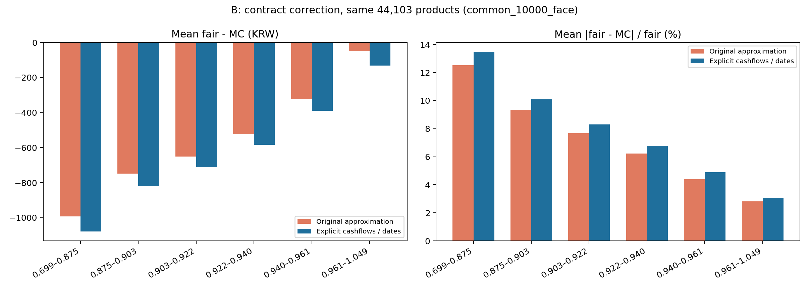
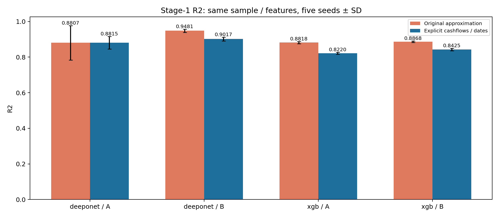
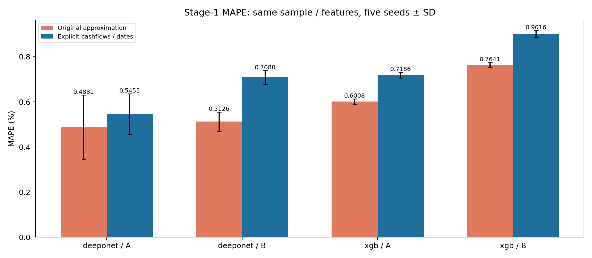
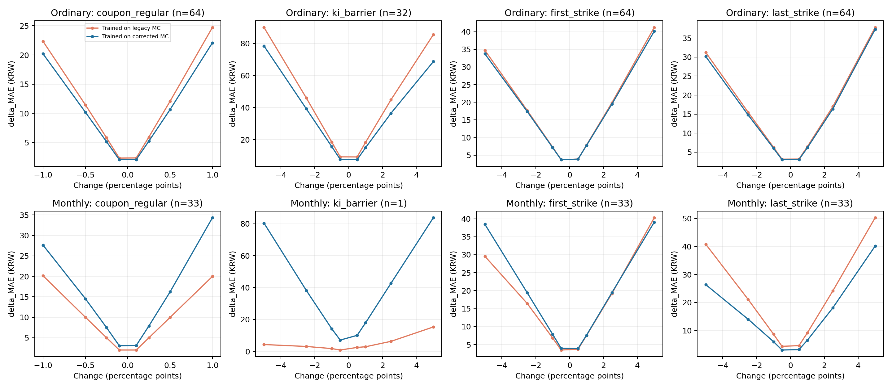
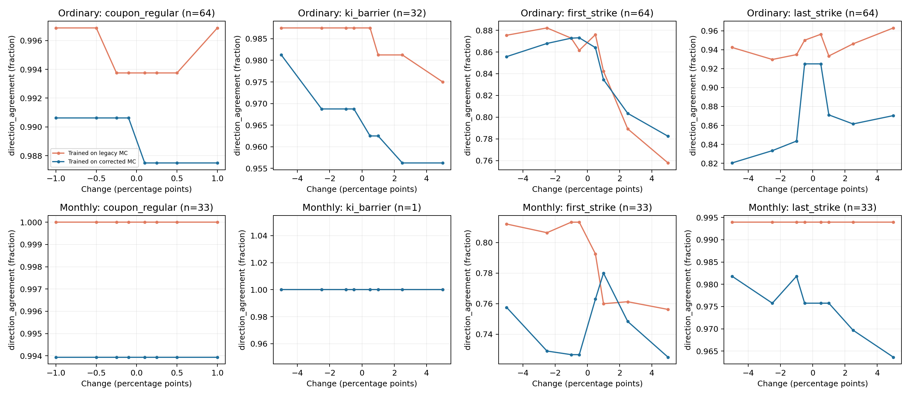

# 계약 지급 규칙 보완 후 재가격·Stage 1·증분 진단

시장 B에서 지급 규칙 수정에 따른 평균 MC 변화는 +71.58원이다. 같은 공통 액면 표본의 공정가 대비 MAE는 643.70원에서 697.95원으로 바뀌었다. 수정된 MC를 공통 정답으로 평가하면 DeepONet의 MAE는 기존 지급 라벨 학습 101.37원, 수정 라벨 학습 68.86원이며, 새 모델 R²는 0.901719이다.

## 1. 보존한 기준과 이번 실행

- 기준 branch: `codex/ppt-pricer-reproduction-20260917`, commit `fae6ecd`.
- 수정 branch: `codex/ppt-pricer-contract-fixes-20260917`.
- 이전 원본 재현 실험과 `main`을 수정하지 않고, 동일 commit에서 별도 worktree를 만들었다.
- 수정 범위: **만기 미낙인 쿠폰, 월 쿠폰 현금흐름, 실제 평가일과 지급일 할인**.
- 기존 분석 표본 58,790개 전체를 원문과 대조했다. 계약 필드로 지원 가능한 상품 44,117개 중 시장 입력도 유효한 **44,103개 전체**를 새로 계산했다. 6개 공시 예제만 다시 계산한 결과가 아니다.
- MC 가격: 상품·시장 설정별 **40,000경로, 기존 상품별 MC 시드 1개**. A/B 각각 같은 난수에서 3개 지급 구현을 평가했다.
- Stage 1: 2개 지급 타깃 × A/B × DeepONet/XGBoost × 학습 시드 0~4 = **40회 설정, 160개 fold 가중치**. 각 실행의 OOS 표본 19,659개로 동일하다.
- 별도 증분 진단: OOS 기준 계약 **97개, 기준·변경 계약 2,689개**, 시장 B 고정, **40,000경로 × 3개 MC 시드**. 이 가격은 학습에 넣지 않았다.

## 2. 원본의 처리와 수정

| 항목 | 원본 재현 엔진 | 이번 구현 |
|---|---|---|
| 만기 미낙인 | 정규 상환 조건 미충족·KI 미발생이면 원금만 지급 | 원문 만기 `PMT_2`를 미낙인 생존 쿠폰으로 더함. `PMT_2` 누락 상품은 임의로 연 쿠폰×만기로 채우지 않고 제외 |
| 월지급형 | 일부를 연 쿠폰×누적 기간의 상환 쿠폰으로 대체 | `SCHD_TYPE=2`의 평가일·배리어·`PMT_1`을 별도 월 현금흐름으로 평가 |
| 평가일 | 만기/회차 수로 균등 배치 | 회차별 실제 `EXER_DT` 사용 |
| 지급일 | 평가일에 바로 지급·할인 | 명시/추정한 회차별 지급일로 할인 |
| 조기상환과 월 쿠폰 | 별도 월 현금흐름 없음 | 상환 후 새 쿠폰 발생 중단. 동일 평가일의 충족 쿠폰과 이미 확정된 쿠폰 보존 |
| 리자드 | FROM_ISU no-touch | 같은 규칙 유지. 정규 상환이 먼저 충족되면 정규 상환 우선 |

핵심 계산은 `PV = Σ(지급일 할인계수 × 해당 경로의 지급액)`이다. 일반형의 만기 정규 조건 미충족 시, KI 발생 경로는 원문에서 지원하는 worst-of 손실 상환을 적용하고, 미발생 경로는 `1 + PMT_2`를 지급한다. 월지급 쿠폰은 지급 조건이 성립한 회차의 현금흐름을 별도로 더한다. 원문 정규 상환 `PMT_1`과 월 지급 `PMT_1`을 섞지 않는다.

`contracts.py`는 원문을 명시적 `ContractV3`로 변환한다. `engine.py`는 동일 경로에 원본, 만기 쿠폰만 추가, 전체 현금흐름 보완을 적용한다. 실제 지급 계산은 기존 `module/mc_contract_v2.py`·`mc_contract_v3.py`의 명시적 지급 함수를 재사용하며 원본 파일은 바꾸지 않았다.

## 3. 지급일 데이터와 남는 가정

원문 `SCHD_INFO`에는 평가일 `EXER_DT`가 있지만 회차별 지급일 필드가 없다. `AUTO_CALL`에는 최종 만기일 `MAT_DT`가 있다. 이는 기초자산 배당 데이터의 누락과 별개다.

- 공시를 개별 대조한 월지급형 6개: 저장된 공시의 지급 지연·일정 사용.
- 나머지: 최종 평가일부터 `MAT_DT`까지 유일하게 식별되는 1~5 한국 은행영업일 지연을 구한 뒤 전 회차에 같은 지연을 적용. **추정 규칙이며 모든 약관의 개별 확인 결과가 아니다.**
- 월 쿠폰의 상환일 지급 조건·이미 확정된 쿠폰의 보존도 지원 범위 내 명시한 가정이다. 메모리 쿠폰·평균 평가·다른 KI 관찰 구간은 자동으로 추정하지 않는다.
- 일별 달력시간 경로, 발행 시 기준 가격 비율 1, 기존 환율/quanto 미보정 등 시장모형 가정은 유지했다. 실제 해외 거래소별 종가 달력과 전 상품의 약관을 완전히 대조한 상태가 아니다.

### 계약 지원 범위

| structure | monthly | n |
| --- | --- | --- |
| LIZARD KI | False | 1616 |
| LIZARD no-KI | False | 8627 |
| LIZARD no-KI | True | 120 |
| STEP KI | False | 14097 |
| STEP KI | True | 2 |
| STEP no-KI | False | 15223 |
| STEP no-KI | True | 4432 |

### 계약 제외 사유

아래는 계약 필터에서 먼저 발견된 사유 기준으로 상품별 1건씩 집계한 값이다. 별도로 시장 입력이 유효하지 않은 14개를 계산에서 제외했다.

| 사유 | 상품수 |
| --- | --- |
| missing_explicit_survival_coupon | 6455 |
| payment_lag_not_identifiable_from_maturity | 4441 |
| unsupported_ki_window | 1033 |
| extra_formula_or_level_PMT_1_FRML | 1017 |
| averaging_not_supported | 682 |
| nonpositive_annual_coupon | 425 |
| unsupported_PRCP_GRTE_RT | 184 |
| extra_formula_or_level_STRK_2 | 150 |
| extra_formula_or_level_PMT_EXTRA | 123 |
| monthly_evaluation_outside_life | 82 |
| second_maturity_payment_without_ki | 24 |
| invalid_evaluation_dates | 21 |
| missing_schedule_values | 21 |
| unsupported_redemption_structure | 11 |
| nonterminal_second_payment | 3 |
| unsupported_redemption_payoff | 1 |

## 4. 고정한 시장 입력과 비교 방법

- A: HV120, 기존 역사적 상관계수, Nelson–Siegel 곡선, 배당 없음.
- B: EWMA120(λ=0.99), 같은 상관계수, CD/IRS 부트스트랩 곡선, 기존 이산 배당락.
- 배당 이력 선택·ETF 대리지수·연간 일정 투영은 이전 재현에서 고정한 규칙을 그대로 사용했다. 원본에서 빠져 있던 배당 실행 파일을 새로 찾았다는 뜻은 아니다.
- 상품별 자산 순서·변동성·상관계수·금리곡선·난수 시드는 유지했다. 실제 마지막 평가일이 기존 경로보다 길 때만 같은 배당 규칙으로 경로를 연장했다.
- 3개 지급 구현은 각 시장 설정 안에서 공통 난수를 사용한다. 가격 차이는 같은 상품·경로에서 계산했다.
- 전체 58,760개였던 이전 결과와 이번 44,103개 결과의 평균을 그대로 비교하지 않는다. **수정 전후 모두 동일한 지원 표본을 사용한다.**

이전 MC 캐시와 이번 공통 경로의 원본 구현 가격 비교:

| variant | n | mean | mean_abs | max_abs | exact_or_1e_8 |
| --- | --- | --- | --- | --- | --- |
| A | 44103 | -0.0000 | 0.0000 | 0.0000 | 44103 |
| B | 44103 | -0.0000 | 0.0000 | 0.0000 | 44103 |

## 5. 지급 규칙을 바꾸어 발생한 가격 차이

원화는 액면 10,000원 기준의 MC 값이다. `월지급·일정 추가 보완`은 만기 쿠폰만 추가한 구현에서 월 쿠폰 분리·원문 정규 지급률·실제 평가일·지급일 할인까지 반영한 추가 차이다. 이 단계의 각 세부 요소를 다시 독립적으로 분리한 ablation은 아니다.

| 시장 | 월지급형 | 상품수 | 만기 쿠폰만 추가(원) | 월지급·일정 추가 보완(원) | 전체 수정 ΔMC(원) |
| --- | --- | --- | --- | --- | --- |
| A | False | 39549 | 39.7226 | 7.0885 | 46.8111 |
| A | True | 4554 | 0.0330 | 73.9192 | 73.9523 |
| B | False | 39549 | 56.6610 | 10.3615 | 67.0225 |
| B | True | 4554 | 0.0402 | 111.1642 | 111.2044 |

## 6. 관측 공정가와 MC의 차이

`common_10000_face`는 발행가가 9,000~10,000원인 원문에 액면 10,000원 가정을 적용해 `FAIR_VALUE - MC×10000`을 비교한다. 공시 6개 외의 액면가는 약관별 개별 대조를 완료한 값은 아니다. `original_normalization`은 이전 PPT 재현과 동일한 `(FAIR_VALUE/ISU_PRC_DETAIL - MC)×10000`이며, 발행가와 액면가가 다르면 공통 원화 기준이 아니다. 두 기준을 구분해서 보관했다.

| basis | variant | payoff | n | mean | median | MAE | RMSE | MAPE | sd |
| --- | --- | --- | --- | --- | --- | --- | --- | --- | --- |
| original_normalization | A | legacy | 44103 | -624.6374 | -641.7232 | 680.8353 | 786.2872 | 7.5619 | 477.5780 |
| original_normalization | A | survival_only | 44103 | -660.2618 | -672.1838 | 710.2169 | 817.3603 | 7.8857 | 481.8066 |
| original_normalization | A | corrected | 44103 | -674.2511 | -684.2742 | 721.0647 | 826.7845 | 8.0060 | 478.5011 |
| original_normalization | B | legacy | 44103 | -498.0752 | -534.8046 | 603.5350 | 709.3306 | 6.6889 | 505.0512 |
| original_normalization | B | survival_only | 44103 | -548.8896 | -579.4856 | 642.9932 | 752.0752 | 7.1242 | 514.1432 |
| original_normalization | B | corrected | 44103 | -569.6599 | -597.2444 | 656.5320 | 763.2074 | 7.2754 | 507.9164 |
| common_10000_face | A | legacy | 44103 | -674.2845 | -697.0571 | 724.1766 | 826.0488 | 8.0755 | 477.1815 |
| common_10000_face | A | survival_only | 44103 | -709.9088 | -724.9018 | 753.6685 | 856.2300 | 8.4009 | 478.7113 |
| common_10000_face | A | corrected | 44103 | -723.8981 | -738.0037 | 764.9679 | 866.1024 | 8.5267 | 475.5103 |
| common_10000_face | B | legacy | 44103 | -547.7222 | -590.5717 | 643.6958 | 746.2980 | 7.1649 | 506.9190 |
| common_10000_face | B | survival_only | 44103 | -598.5367 | -633.3447 | 683.4624 | 787.9690 | 7.6042 | 512.4987 |
| common_10000_face | B | corrected | 44103 | -619.3069 | -652.4611 | 697.9467 | 799.9802 | 7.7662 | 506.3923 |

가격을 수정한 결과가 공정가에 가까워졌는지와 지급 규칙이 정확한지는 다른 질문이다. 지급 규칙은 원문 현금흐름과 명시한 지급일 가정을 기준으로 구성했으며, 위 표는 관측 차이에 대한 진단이다.

## 7. Stage 1 재학습 결과

기존 51개 계약 입력, 시장 입력 구성, 모델 구조, 학습 설정, 원래 58,790행에서 정한 시간 순 fold 경계와 검증 분할을 유지했다. 그 뒤 동일한 지원 표본으로 제한했다. 수정 전후 모두 새로 학습했으며 타깃은 각 지급 구현의 MC 가격이다. Stage 2와 PI 손실은 사용하지 않았다.

| 지급 구현 | 모델 | 시장 | R² 평균 | R² SD | MAE(원) | MAPE(%) | MAPE SD |
| --- | --- | --- | --- | --- | --- | --- | --- |
| corrected | deeponet | A | 0.8815 | 0.0354 | 53.6364 | 0.5455 | 0.0900 |
| corrected | deeponet | B | 0.9017 | 0.0110 | 68.8593 | 0.7080 | 0.0307 |
| corrected | xgb | A | 0.8220 | 0.0056 | 70.7269 | 0.7186 | 0.0128 |
| corrected | xgb | B | 0.8425 | 0.0072 | 87.5949 | 0.9016 | 0.0151 |
| legacy | deeponet | A | 0.8807 | 0.0965 | 47.6392 | 0.4881 | 0.1419 |
| legacy | deeponet | B | 0.9481 | 0.0096 | 49.4164 | 0.5126 | 0.0430 |
| legacy | xgb | A | 0.8818 | 0.0060 | 58.8208 | 0.6008 | 0.0120 |
| legacy | xgb | B | 0.8868 | 0.0043 | 73.5887 | 0.7641 | 0.0103 |

두 행의 R²는 서로 다른 MC 타깃 분산을 사용한다. 수정 전후 R²만으로 같은 문제의 성능이 개선되었다고 단정하지 않는다. 다음 표는 **모두 수정된 MC를 정답으로 사용**하여 기존 지급 라벨로 학습한 모델과 새 라벨로 학습한 모델을 비교한 5시드 평균이다.

| train_payoff | model | variant | R2 | MAE | MAPE |
| --- | --- | --- | --- | --- | --- |
| corrected | deeponet | A | 0.8815 | 53.6364 | 0.5455 |
| corrected | deeponet | B | 0.9017 | 68.8592 | 0.7080 |
| corrected | xgb | A | 0.8220 | 70.7269 | 0.7186 |
| corrected | xgb | B | 0.8425 | 87.5949 | 0.9016 |
| legacy | deeponet | A | 0.7498 | 79.3089 | 0.8028 |
| legacy | deeponet | B | 0.7972 | 101.3663 | 1.0346 |
| legacy | xgb | A | 0.6846 | 95.2573 | 0.9646 |
| legacy | xgb | B | 0.6591 | 133.3695 | 1.3628 |

같은 수정 MC 정답에 대한 시장 B DeepONet의 지급형별 가격 오차:

| train_payoff | monthly | n | MAE | RMSE | MAPE |
| --- | --- | --- | --- | --- | --- |
| corrected | False | 17433.0000 | 65.6747 | 100.4973 | 0.6742 |
| corrected | True | 2226.0000 | 93.7990 | 128.2530 | 0.9732 |
| legacy | False | 17433.0000 | 96.4665 | 145.5285 | 0.9802 |
| legacy | True | 2226.0000 | 139.7387 | 178.2071 | 1.4603 |

실제 평가/지급 일정과 월 쿠폰별 배리어·지급액은 MC에 반영했지만, 이번 통제 비교에서는 DeepONet/XGBoost의 입력을 확장하지 않았다. 원래 51개 입력만으로 구별되지 않는 계약 차이는 학습 모형의 한계로 남을 수 있다. 가격 R²가 높다는 사실만으로 증분 예측의 안정성을 판정하지 않는다.

## 8. 수정된 MC 기준의 증분 진단

같은 계약의 다른 조건과 일정을 고정하고 연 쿠폰 ±0.1/0.25/0.5/1%p, KI·첫/만기 행사가 ±0.5/1/2.5/5%p를 평가했다. KI가 있는 계약만 KI를 변경했다. 연 쿠폰 변경은 정규·미낙인 생존·월 쿠폰을 같은 비율로 바꾸며 별도 리자드 보너스는 고정한다. 원래 시간 순 OOS에 속하는 구조별 최대 16개 계약을 오차 확인 전에 일정 간격으로 선택했다.

주요 양의 변경 폭에 대한 MC 증분:

| monthly | axis | n | mean_delta | min_delta | max_delta | mean_paired_SE |
| --- | --- | --- | --- | --- | --- | --- |
| False | coupon_regular | 64 | 69.6122 | 23.3952 | 128.3049 | 0.1843 |
| False | first_strike | 64 | -33.0326 | -198.0265 | 87.9812 | 1.6349 |
| False | ki_barrier | 32 | -156.8656 | -423.9012 | -18.8225 | 2.6448 |
| False | last_strike | 64 | -29.5511 | -173.7428 | 0.0000 | 0.8509 |
| True | coupon_regular | 33 | 99.3119 | 57.3525 | 139.8773 | 0.1863 |
| True | first_strike | 33 | -6.7735 | -94.1650 | 43.7423 | 1.3958 |
| True | ki_barrier | 1 | -127.3782 | -127.3782 | -127.3782 | 1.9337 |
| True | last_strike | 33 | -84.2790 | -222.9938 | -6.5271 | 1.5327 |

아래는 모델별·학습 시드별 개별 예측의 오차를 모든 변경 폭에 걸쳐 평균한 값이다. 5개 모델을 앙상블한 값이 아니다. 방향은 `|ΔMC| > 1.96×paired SE`이고 영향 경로 30개 이상인 경우에만 집계했다. 3개 MC 시드의 최소·최대는 `probe_mc.csv`, 변경 폭별 성능은 `probe_metrics.csv`에 있다.

| 학습 지급 구현 | 모델 | 월지급형 | 증분 MAE(원) | 증분 RMSE(원) | 유의한 MC 증분 방향 일치율(%) | 방향 평가 행수 |
| --- | --- | --- | --- | --- | --- | --- |
| corrected | deeponet | False | 16.5069 | 31.3304 | 91.4864 | 7905 |
| corrected | deeponet | True | 15.6935 | 27.1054 | 90.9487 | 3900 |
| corrected | xgb | False | 22.6175 | 38.4431 | 65.6040 | 7905 |
| corrected | xgb | True | 27.6756 | 42.4334 | 54.2821 | 3900 |
| legacy | deeponet | False | 18.0318 | 33.2999 | 93.9279 | 7905 |
| legacy | deeponet | True | 15.0760 | 25.8156 | 93.2051 | 3900 |
| legacy | xgb | False | 22.4061 | 38.9550 | 70.6135 | 7905 |
| legacy | xgb | True | 28.4223 | 43.1214 | 64.1538 | 3900 |

같은 수정 MC 증분을 정답으로 비교하면, DeepONet 증분 MAE는 일반형 18.03→16.51원, 월지급형 15.08→15.69원이다. 방향 일치율은 일반형 93.93→91.49%, 월지급형 93.21→90.95%다. 일반형 평균 증분 오차는 줄었지만 월지급형과 방향 정확도가 함께 개선된 결과는 아니다. 모든 조건에서 안정적인 증분 예측을 달성했다고 결론 내릴 수 없다.

월지급형 KI 증분은 기준 계약 1개에서 나온 결과이므로 월지급형 KI 전체로 일반화하지 않는다.

이 진단은 명시한 MC 모형 안의 반사실 가격 차이다. 실제 관측 공정가의 인과효과를 입증한 실험이 아니다. 관측 횟수·만기 변경은 이번 신규 진단에 포함하지 않았다. 과거 별도 일정 실험 결과를 이번 새 라벨·모델의 결과로 재사용하지 않았다. 상세 지급 규칙 반영과 모든 계약의 안정적인 증분 예측 달성도 동일한 결론이 아니다.

## 9. 검증과 재현

- 만기 생존 쿠폰, KI 손실, KI 후 만기 조건 충족, 조기상환, 리자드 우선순위, 월 쿠폰 조건·중단·동일일 처리, 늦게 지급되는 확정 쿠폰, 지급일 할인에 대한 경로별 검증 통과.
- 별도 순차 NumPy 현금흐름 장부와 GPU 벡터화 계산 대조 통과.
- 원래 경로 범위가 같은 사례에서 원본 엔진과 가격이 정확히 일치함을 검증.
- 고정된 원본 자료 153개 해시 보존.
- 저장된 160개 fold 가중치를 재로딩해 예측값 대조. 최대 차이 1.77e-07(액면 비율).
- 입력 해시, 제외 목록, 가격, 표준오차, 예측, 그림, 가중치를 이 branch에 함께 보관.

실행 명령과 파일 위치는 [README](README.md)에 있다. 그림 생성은 저장된 결과만 읽으며 MC를 다시 계산하지 않는다.
