# 2026-09-17 PPT: 원천 데이터부터 전체 MC·Stage 1 재실행

**전체 대상 MC 재계산과 새 MC 타깃을 사용한 DeepONet·XGBoost 각 5시드 학습을 완료했다.** 작업 branch는 `codex/ppt-pricer-reproduction-20260917`이다. 기존 main 및 이전 결과를 덮어쓰지 않고 이 폴더에 전체 실행을 추가했다.

종전 `ppt_reproduction_20260917`은 원본 MC 캐시 재학습과 12개 가격 점검이었다. **이번 폴더는 58,760개 전부 새로 가격했다.** 원본 가격은 사후 비교에만 사용하며 이번 모델의 학습 라벨로 사용하지 않았다. 실제 원본 실행 파일이 누락된 배당·실행 래퍼 부분은 명시한 규칙으로 복원했다. 실행 완료와 원본 코드의 완전 동일성은 별개다.

## 1. 실행 결과 범위

| 단계 | 실제 실행 |
|---|---|
| DART 원문 3종부터 재구성 | 원본 `build_source(save=False)`, 58,790개; 상품 ID·계약·FAIR·스케줄 동일 |
| 시장 입력 새 계산 | 종가·배당·금리 파일에서 HV/EWMA·상관·금리·배당 이벤트 생성 |
| 유효 대상 | 58,760개; 오래된 종가 30개 제외, 입력 실패 18개는 이 30개에 포함 |
| 전체 MC | 58,760 × 40,000경로 × A/B = 4,700,800,000경로 |
| Stage 1 | 2모델 × 2사양 × 5시드 = 20회; 각 4폴드, 총 80개 가중치 |
| OOS 평가 | 실행마다 동일 23,486개 상품, 새 MC만 타깃 |
| 그림·표 | 전체/200개 분위·분포·연도·곡선, R²·MAPE·MAE·RMSE·예측오차 |
| 재검증 | 원본 153파일 해시, 입력·MC 출력 해시, 80개 가중치 재로딩·예측 확인 |

`results/full_mc_completion.json`, `full_mc_protocol.json`, `verification.json`에 완료 건수·경로 수·해시를 저장했다. 저장된 경로별 전체 시계열은 용량상 보관하지 않으며 입력·seed·MC 평균·표준오차로 실행을 재현할 수 있다.

## 2. 원본과의 방법 대조

| 항목 | 이번 실행 | 확인 근거 / 남는 차이 |
|---|---|---|
| 원천 | 기존 압축 DART 원문 3종 + 제공 ZIP의 시장 캐시 | 최신 인터넷 재다운로드에 따른 개정값 혼입 없음 |
| 표본·필터 | 3기초자산, KRW, STEP/LIZARD × KI/No-KI, FAIR 비율 0.70~1.05, 만기 0.5~5년 | 원본 `build_source` 호출. 58,790개 일치 |
| 계약·스케줄 | 원문에서 다시 추출 | 원본 저장 계약 48스케줄 열과 핵심 수치 최대 차이 0 |
| A 변동성 | 발행 전 각 자산 최근 120거래일 표준편차 × √252 | 유효 전체 원본 입력과 부동소수점 정밀도 이내 일치 |
| B 변동성 | 같은 창의 EWMA λ=0.99, adjust=True | 동일. IV가 아닌 역사적 수익률 입력 |
| 상관 | KOSPI200 최근 120거래일로 달력 구간 결정, 그 구간 자산쌍별 Pearson | 3자산 공통거래일 120개를 고른 방식과 구별. 원본 전체 일치 |
| A 금리 | NS λ=1.5, 콜·3개월·10년 노드 | 발행 월 평균 FRED 금리를 사용하는 원본 유지 |
| B 금리 | 발행 전 IRS, 직전 완결월 CD91, 분기 IRS 부트스트랩·log DF 보간 | B 10노드 최대 오차 약 6e-16. 20Y 2개 결측은 직전값 이월; 사용 10Y 이하 및 5Y 이하 MC에 영향 없음 |
| 배당 | 개별주식 자체 이력, 지수 ETF 대용; 발행 전 과거 배당만 사용 | 아래 복원 규칙 참조. q 최대 차이 3.36e-9, 이벤트 횟수 전체 일치 |
| 할인·드리프트 | 각 A/B 곡선을 둘 다 적용 | 할인만 바꾼 비교 아님 |
| 시뮬레이션 | 원본 노트북 5 일별 GBM 함수, 365일/년, 4만경로, mc_seed, float32 | 원본 지급·난수 함수 직접 추출. PPT의 10만 표기는 이번 4만 실행과 다름 |
| 지급 | 원본 균등 평가일, 스케줄 쿠폰·리자드, 월지급 누적근사 유지 | 이전에 보완한 상세 지급 엔진과 혼합하지 않음 |
| 모델 | 원본 `_anchor`, `_xgb_anchor`, config 사용 | 누락된 최신 실행 래퍼만 재작성 |

### 배당 복원에서 확실한 부분과 가정

최신 노트북이 호출하는 `scratch/mc_discrete_div.py`, `mc_boot_curve.py`, `mc_full_variants.py`, `stage1_mc_variants.py`, `mc_noise_check.py`는 제공된 두 ZIP과 기존에 확보한 scratch에서 찾지 못했다. 기존 scratch를 받지 않았다는 뜻이 아니라, 이 최신 실행 파일들이 없다는 뜻이다.

원본 설명은 “발행 전 마지막 분배일을 기준으로 1년 창, 이후 매년 반복”이다. 이번에는 **마지막 과거 배당일부터 330달력일 이내 이력**을 고르고 `δ=배당/전일 종가`, `log(1−δ)` 하락을 과거 배당일의 달력상 기념일마다 적용했다. 발행일 당일은 제외하고 만기까지 포함한다. 예상 현금배당의 고정 원 금액 대신 과거 배당수익률의 비례 하락을 반복하는 모델이다.

첫 360일 가정은 국내 4종목에서 334~336일 전 배당을 한 차례 더 포함했다. 그 결과 q 114개 슬롯 및 이벤트 횟수 80개 상품이 원본과 달랐다. 330일 규칙은 전체 유효 상품의 저장 q·횟수를 재현한다. 이 초기 입력 감사도 `results/input_audit_initial_360/`에 보관했다. **330이 원본 실제 코드 상수였다고 확인한 것은 아니며, 이것만으로 개별 미래 이벤트 날짜의 동일성이 증명되지 않는다.** 이 선택에는 원본 MC 가격이나 FAIR 오차를 사용하지 않았다.

지수 대용: EURO STOXX50→FEZ, S&P500→SPY, HSCEI→FXI, KOSPI200→069500.KS, Nikkei225→1321.T, HSI→2800.HK, NASDAQ100→QQQ. DAX는 실제 노트북·캐시대로 배당 0이다. PPT appendix의 DAX→EWG 표기와는 다르다.

### 재현을 위해 유지한 원본의 한계

- 원본 엔진은 만기 미상환·미낙인 경로에 원금만 지급하고, 월지급형 일부를 누적 쿠폰으로 근사한다. 원본 재현을 위해 보존했으며 실제 전 상품 약관을 검증했다는 의미가 아니다. 상세 지급 구현은 기존 다른 실험에 별도로 보존되어 있다.
- A의 발행 월 평균 금리는 발행 당시 아직 알려지지 않은 날짜를 포함할 수 있다. 이번 결과를 엄격한 과거 시점 가용 데이터 검증이라고 부르지 않는다.
- 지수 ETF 배당일은 지수 구성종목 배당락일과 같지 않다. 시장 휴일·결제일 및 퀀토 조정은 원본과 같은 근사를 유지한다.
- `fair=FAIR_VALUE/ISU_PRC_DETAIL`, MC=단위 액면 값을 비교하여 10,000을 곱하는 원본 정의를 유지했다. 발행가와 액면가가 다른 상품도 공통 현금 단위로 재정규화한 것은 아니다.

## 3. 전체 새 MC와 공정가의 차이

| 전체 58,760개 지표 | A: NS·HV120·무배당 | B: 부트스트랩·EWMA120·이산배당 |
|---|---|---|
| 공정가−MC 평균 (원) | -559.4023 | -427.1664 |
| MAE (원) | 634.7810 | 566.7689 |
| RMSE (원) | 747.1987 | 681.4344 |
| MAPE (%) | 7.0218 | 6.2533 |
| 차이 표준편차 (원) | 495.3576 | 530.9298 |

B−A 평균 차이 이동은 +132.24원이고, MAE 변화는 -68.01원, MAPE 변화는 -0.7685%p이다. 분포 표준편차 변화는 +35.57원이다. 평균이 0에 가까워지는 것과 산포가 좁아지는 것은 별개다.

이 표의 MAPE는 **mean(|FAIR−MC|/FAIR)**이다. 다음 절 모델 MAPE는 **mean(|예측MC−MC|/MC)**이므로 같은 지표처럼 비교하면 안 된다. A/B는 변동성·곡선·배당을 동시에 바꾼 비교다. 이 전체 결과만으로 세 요소 각각의 기여도를 식별한 ablation이라고 하지 않는다.

### 원본 MC 캐시와 새 계산의 직접 비교

| 사양 | 평균 새 MC−원본 MC (원) | 평균 절대 차이 (원) | 95% 분위 절대 차이 (원) | 최대 절대 차이 (원) | 새 MC 평균 표준오차 (원) |
|---|---|---|---|---|---|
| A | 0.003 | 6.624 | 20.235 | 66.005 | 6.280 |
| B | 0.035 | 8.028 | 23.415 | 76.611 | 7.683 |

원본 캐시와 이번 가격 차이는 전체 평균뿐 아니라 상품별 절대 차이로 기록했다. 표준오차는 새 MC의 경로별 할인 지급액 분산으로 계산했다. 이는 원본 캐시의 난수·장치 차이 및 누락된 배당 규칙 차이를 전부 설명하는 증거는 아니다. **차이를 모두 MC 잡음이라고 단정하지 않는다.** 동일 원본 함수·동일 seed의 무배당 실행은 원본 함수 호출과 정확히 같은 가격이며, 동일 장치 반복도 일치함을 별도로 확인했다.

## 4. 새 MC 타깃 Stage 1 재학습

| 모델 | 사양 | 원본 R² | 새 MC 재학습 R² 평균 ± SD | 원본 MAPE (%) | 새 MC 재학습 MAPE (%) 평균 ± SD |
|---|---|---|---|---|---|
| deeponet | A | 0.9305 | 0.9418 ± 0.0224 | 0.4192 | 0.4049 ± 0.0790 |
| deeponet | B | 0.9468 | 0.9446 ± 0.0125 | 0.5440 | 0.5563 ± 0.0732 |
| xgb | A | 0.9041 | 0.9035 ± 0.0014 | 0.5854 | 0.5924 ± 0.0066 |
| xgb | B | 0.9155 | 0.9143 ± 0.0016 | 0.7037 | 0.7094 ± 0.0067 |

| 모델 | 사양 | MAE 평균 ± SD (원) | RMSE 평균 ± SD (원) |
|---|---|---|---|
| deeponet | A | 39.41 ± 7.66 | 67.53 ± 12.75 |
| deeponet | B | 53.47 ± 7.05 | 84.59 ± 9.24 |
| xgb | A | 57.92 ± 0.67 | 88.17 ± 0.62 |
| xgb | B | 68.29 ± 0.66 | 105.70 ± 0.98 |

DeepONet에서 B−A의 R² 변화는 +0.0028, MAPE 변화는 +0.1514%p이다. 원본 노트북의 R² 증가 +0.0163와 이번 증가 +0.0028는 같지 않다. 같은 시드에서 B의 R²가 A보다 높았던 경우는 3/5회다. **원본의 R² 상승 폭까지 그대로 재현했다고 말할 수 없다.** 다른 MC 타깃 분포를 학습한 결과이므로 R²만 보고 가격 근사 오차가 개선되었다고 결론내리지 않는다. MAE·RMSE·MAPE를 함께 제시한다. 원본 수치는 PPT와 연결된 노트북 18의 저장 출력에서 추출했으며 새 실행 결과와 별도 열로 표시했다.

| 모델 | 사양 | OOS MC 표준편차 (원) | 예측오차 표준편차 (원) | 평균 예측편향 (원) | MC 평균 표준오차 (원) |
|---|---|---|---|---|---|
| deeponet | A | 283.88 | 68.47 | 1.20 | 6.67 |
| deeponet | B | 361.01 | 83.01 | -18.27 | 8.01 |
| xgb | A | 283.88 | 88.14 | -2.39 | 6.67 |
| xgb | B | 361.01 | 102.16 | -27.18 | 8.01 |

설정: 학습 seed 0~4, 4개 expanding walk-forward 폴드(60/70/80/90/100%), train 내부 12% validation(seed0), DeepONet MSE·최대 3,000iteration·batch512·lr0.001·P192·width128, XGBoost 최대700tree·depth7·lr0.03. 원본처럼 전체 58,790행에서 경계를 만든 뒤 부적합 행을 제거하여 OOS 23,486개가 된다. 동일 발행일이 train/test 경계에 걸릴 수 있는 행 기준 분할도 유지한다.

XGBoost에는 원본 시간감쇠 표본가중이 적용되지만 DeepONet 원본 `train_curve`에는 가중 적용이 없다. 원본 코드 동작 그대로 사용했다. Stage 2 및 공정가 잔차 모델은 실행하지 않았다. **이번 학습은 가격 수준 예측 재현이며 새 B 기반 계약조건 증분의 안정성을 검증한 결과는 아니다.**

80개 저장 가중치를 각각 다시 불러와 폴드별 32개 상품의 예측을 대조했다. 저장 CSV와 최대 가격비율 차이는 1.75e-07이다. 각 학습의 입력 파일·코드 해시와 config는 `*_fingerprint.json`, `*_execution.json`에 있다.

## 5. 최신 PPT와의 비교

[PPT 원본 그림과 새 그림 나란히 보기](PPT_COMPARISON.html). HTML은 로컬에서 열거나 다운로드해서 볼 수 있다. GitHub에서는 아래 PNG를 바로 확인할 수 있다.

| PPT | 사용 표본 / 재현 결과 |
|---|---|
| 7p 분위별 차이 | 원본 노트북17의 200개. 이번에도 복원 200개 그림 + 전체 58,760개 그림 별도 생성 |
| 8p 히스토그램 | 전체 58,760개. 원본 −559/−427원과 이번 값은 위 표에서 비교 |
| 9p 곡선 | 예시 날짜 2021-06-24·2023-06-27 일치. 200개 복원 표본 곡선도 생성 |
| 10p 곡선 시계열 | 복원 200개 NS 3Y·부트스트랩 3Y·IRS 3Y·CD91 시계열. 별도로 전체 발행일 3Y·10Y도 제공 |
| 11p 연도별 차이 | 원본은 200개, 평균 차이·MAE. 이번에도 동일 지표의 복원 200개와 전체 별도 제공 |
| 12p R²·13p MAPE/분포 | 새 MC 라벨로 5시드 재학습, OOS 지표와 노트북 출력 비교 |

노트북16 설명대로 DAX·삼성바이오로직스·LG에너지솔루션이 들어간 상품을 제외하면 58,405개다. 그 정렬된 행에서 등간격 200개를 택했다. **6개 분위 경계·연도별 상품 수·두 곡선 예시 날짜가 PPT/원본 노트북과 일치**하지만 원본 전체 상품 ID 목록이 없으므로 200개 전부 동일하다고 확정하지 않는다. 이 복원 표본의 새 MC 요약은 다음과 같다.

| 200개 복원 표본 | A | B |
|---|---|---|
| 평균 FAIR−MC (원) | -517.141 | -375.957 |
| MAE (원) | 640.801 | 587.990 |
| MAPE (%) | 7.063 | 6.459 |

| 사양 | 지표 | 원본 200개 | 새 200개 | 차이 |
|---|---|---|---|---|
| A | mean | -517.3720 | -517.1413 | +0.2307 |
| A | MAE | 640.9810 | 640.8007 | -0.1803 |
| A | RMSE | 751.9950 | 751.4280 | -0.5670 |
| A | MAPE | 7.0660 | 7.0630 | -0.0030 |
| B | mean | -376.1370 | -375.9570 | +0.1800 |
| B | MAE | 588.3380 | 587.9896 | -0.3484 |
| B | RMSE | 706.6820 | 705.8375 | -0.8445 |
| B | MAPE | 6.4640 | 6.4594 | -0.0046 |

방법 확인 결과: 표본/필터/계약 및 저장 시장 입력은 전체 일치한다. 원본 지급 엔진·모델 핵심 함수는 그대로 사용했다. 배당 이벤트 구성 및 누락된 학습 래퍼는 복원한 부분이며, 실행 장치·라이브러리·난수 구현 차이도 남는다. 수치 차이는 `fresh_vs_source_price_summary.csv`, `notebook_vs_rerun.csv`에 수록했다. 완전 동일한 원본 실행 코드를 확보했다거나 모든 차이의 원인을 확정했다고 표현하지 않는다.

## 6. 그림

### 전체 공정가−MC 분포

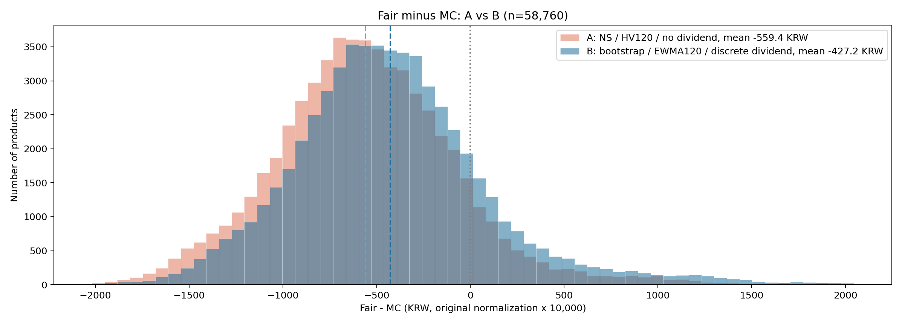

[PDF](figures/fair_mc_histogram.pdf)

### 전체 공정가 6분위별 차이

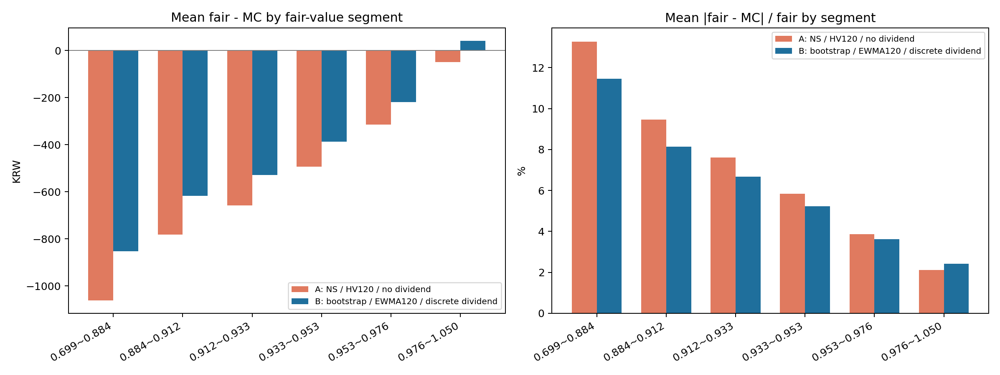

[PDF](figures/fair_mc_by_segment.pdf)

### 전체 발행연도별 차이

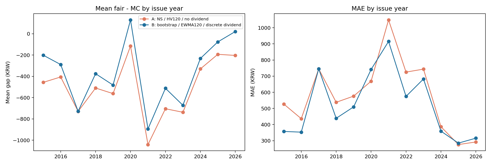

[PDF](figures/fair_mc_by_year.pdf)

### 200개 복원 표본 분위별 차이

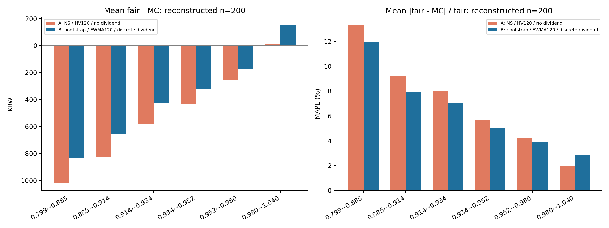

[PDF](figures/sample200_by_segment.pdf)

### 200개 복원 표본 연도별 차이

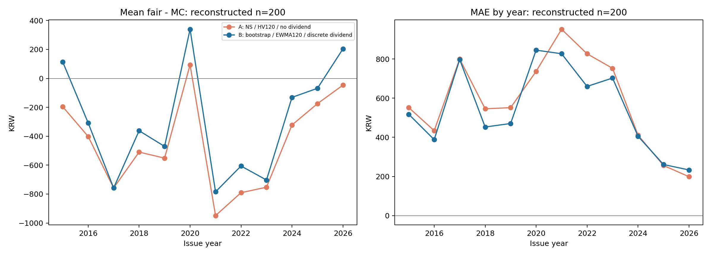

[PDF](figures/sample200_by_year.pdf)

### 금리곡선 예시와 차이

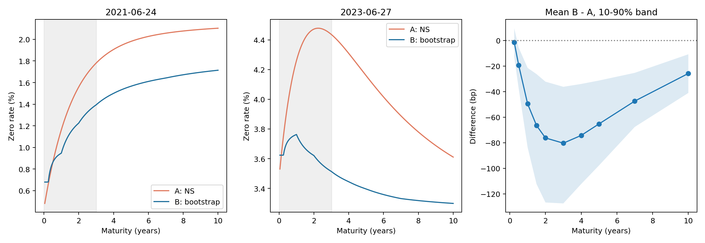

[PDF](figures/curve_comparison.pdf)

### PPT와 같은 200개 3Y·CD91 시계열

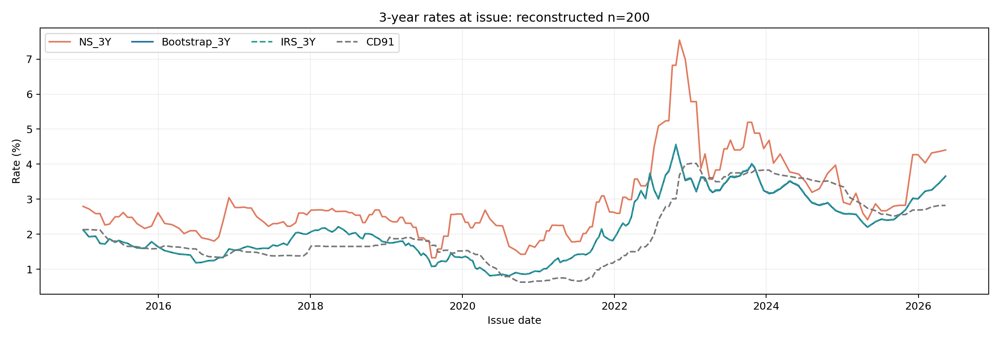

[PDF](figures/sample200_curve_history.pdf)

### 추가: 전체 발행일 금리곡선 시계열

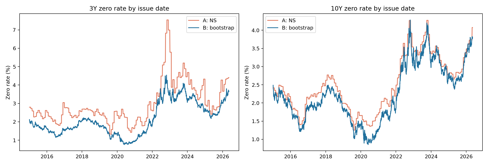

[PDF](figures/curve_history.pdf)

### Stage 1 R²

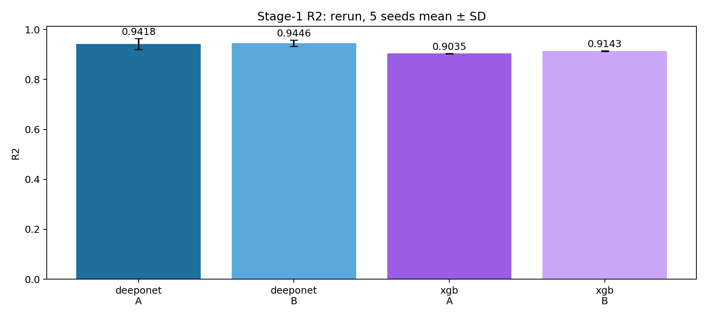

[PDF](figures/stage1_r2.pdf)

### Stage 1 MAPE

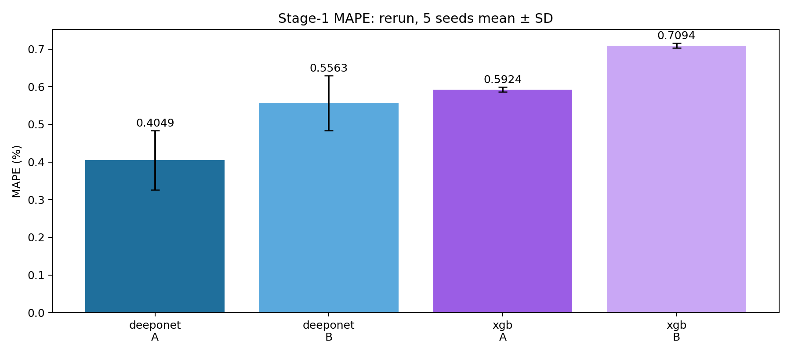

[PDF](figures/stage1_mape.pdf)

### Stage 1 예측 오차 분포

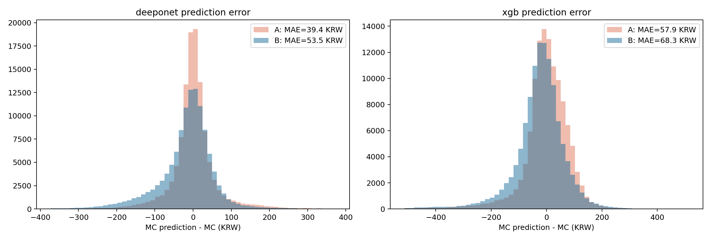

[PDF](figures/stage1_error_histogram.pdf)

### Stage 1 OOS 폴드별 결과

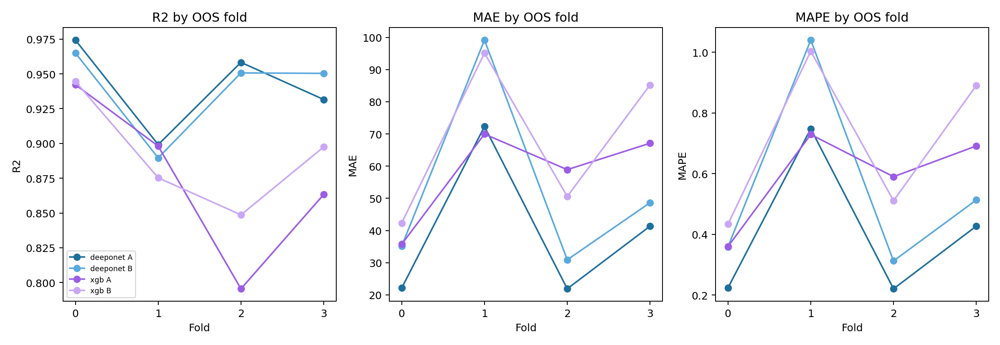

[PDF](figures/stage1_by_fold.pdf)

### 원본 캐시와 새 MC의 상품별 차이

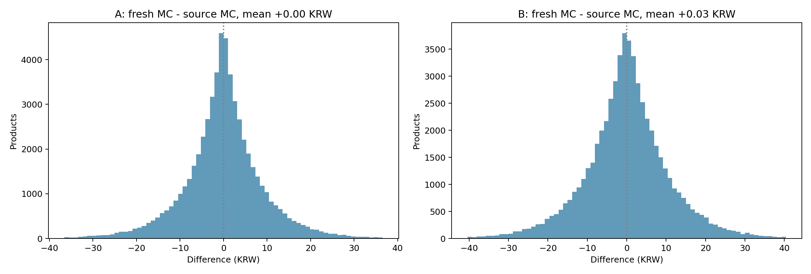

[PDF](figures/fresh_vs_source_mc.pdf)

## 7. 다시 실행하거나 그림만 갱신하는 방법

저장소 루트에서 Python 3.11, torch 2.9.1+cu126, numpy 2.3.0, pandas 2.3.0, XGBoost 3.2.0 환경을 사용했다. MC는 4개 RTX3090으로 분산했다. 입력 원문·시장 캐시는 저장소에 이미 포함되어 있으며 인터넷 재수집이 필요 없다.

```bash
python analysis/ppt_full_reproduction_20260917/build_universe.py
python analysis/ppt_full_reproduction_20260917/prepare_inputs.py
python analysis/ppt_full_reproduction_20260917/run_mc.py --workers 4
python analysis/ppt_full_reproduction_20260917/run_training.py
python analysis/ppt_full_reproduction_20260917/sample200.py
python analysis/ppt_full_reproduction_20260917/compare_pricing.py
python analysis/ppt_full_reproduction_20260917/verify_results.py
python analysis/ppt_full_reproduction_20260917/ppt_comparison.py
python analysis/ppt_full_reproduction_20260917/write_report.py
```

같은 작업폴더에서는 완료된 MC 중간 worker 기록·학습 결과를 입력과 코드 해시 확인 후 재사용한다. Git에서 새로 받은 환경에서 MC 명령을 실행하면 중간 worker가 없으므로 전체 MC를 새로 계산한다. Git에는 전체 MC를 압축 CSV·Parquet로 저장하며 중간 worker JSONL과 원문 압축 해제본은 제외한다. 완전히 새 계산이 필요하면 이 폴더를 새 이름으로 복사하고 `results/`·`figures/`를 비운 복사본에서 실행한다. 원본 폴더는 보존한다.

그림만 다시 만들 때는 `plot_results.py`, `sample200.py`, `compare_pricing.py`, `ppt_comparison.py`만 실행한다. **그림 하나마다 MC·학습을 다시 할 필요가 없다.** 원본 PPT에서 추출한 이미지와 해시는 `ppt_reference/`에 보관했다.

다음 실험에서는 이 기준 위에서 배당·곡선·EWMA를 각각 분리한 ablation과 계약조건 증분 검증을 진행할 수 있다. 이번 결과만으로 해당 후속 실험을 완료한 것으로 간주하지 않는다.
