# 발표 기준 Pricer 재현 및 두 지급 구현의 증분 평가

실제 그림을 만든 코드·저장 표본을 먼저 고정하고 제공된 ATM IV를 연결했다. 같은 조건의 4만 경로 재계산과, 같은 합성 계약에 대한 두 지급 구현의 MC·DeepONet 평가를 구분한다. 기존 main과 이전 IV branch의 결과는 보존했다.

## 그림의 출처 확인

앞선 23,151개 STEP KI 그림과 이후 58,790개 4구조 IV 비교 그림은 서로 다른 저장 표본이다. 다음은 기존 저장 가격을 재집계한 값이며 새 4만 경로 결과와 구분한다.

| 표본 | 가격 | 상품수 | 평균차이 | 중앙값 | MAE | MAPE |
| --- | --- | --- | --- | --- | --- | --- |
| legacy | Archived HV | 23151 | -506.99 | -507.27 | 582.29 | 6.44 |
| hv_iv | Archived HV | 58790 | -556.03 | -568.90 | 613.69 | 6.78 |
| hv_iv | Archived IV | 58790 | -520.07 | -568.30 | 684.01 | 7.54 |

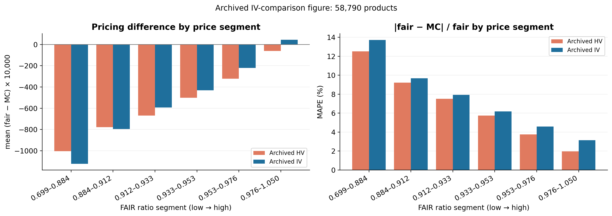

## 고정한 계산 조건

| 항목 | 재현 기준 |
|---|---|
| 상품 | 원본 58,790개 ID·계약 조건 그대로 |
| HV·상관 | 발행일 전 180개 수익률, 최소 60개; HV는 표본표준편차×√252 |
| IV | 원본 8개 지수 매핑, 발행일 이하 최근 ATM IV; 미제공 자산은 HV |
| 할인 | HV는 NS; 원본 IV 그림은 3개 금리점의 선형 제로금리 보간 |
| 추가 대조 | IV를 유지하고 NS 할인으로 계산 |
| 경로 | 일별 GBM, q=0, dt=1/365, 원본 평가일 반올림과 난수 시드 |
| 실제 상품 MC | 40,000경로·상품별 1시드; 원본 IV 100,000경로와 구분 |
| 합성 MC | 학습·검증 40,000경로×1시드, 시험·진단 40,000경로×3시드 |

원본 코드의 `bootstrap`은 여기서는 3개 금리를 제로금리로 간주한 선형 보간이다. 채권 현금흐름을 순차적으로 부트스트래핑한 구현은 아니다. 이 명칭과 구현을 구분했다.

원본 plot 계산식을 그대로 재현했다: `(fair - mc) × 10,000`, `abs(fair - mc) / abs(fair) × 100`. `fair`는 발행가로 나눈 관측값이고 `mc`는 단위 액면 현금흐름의 현재가치이다. 발행가와 액면가가 다른 상품에서 두 분모가 일치한다고 주장하지 않는다. 합성 가격·증분과 모델 오차는 모두 액면 10,000원 기준이다.

## 4만 경로 재계산

| 가격 | 상품수 | 평균차이 | 중앙값 | MAE | MAPE |
| --- | --- | --- | --- | --- | --- |
| HV + NS | 58790 | -556.06 | -568.64 | 613.66 | 6.78 |
| IV + NS | 58790 | -507.47 | -555.66 | 671.91 | 7.41 |
| IV + source discount | 58790 | -520.11 | -568.24 | 684.05 | 7.54 |

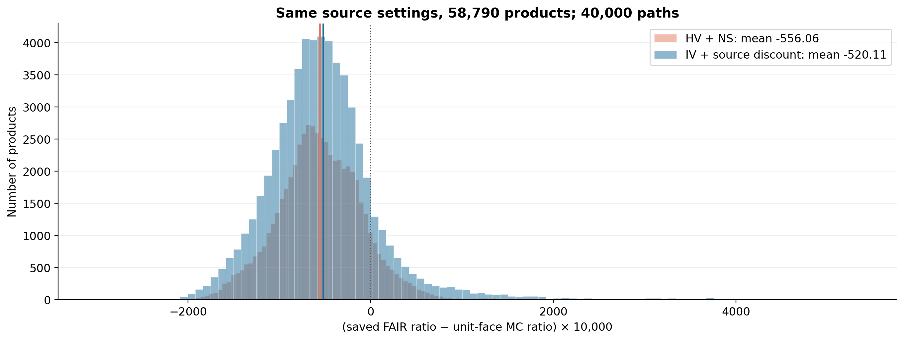
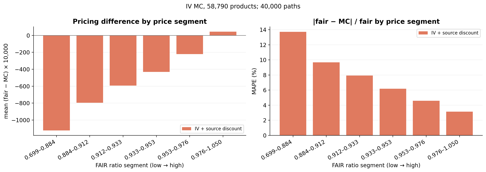
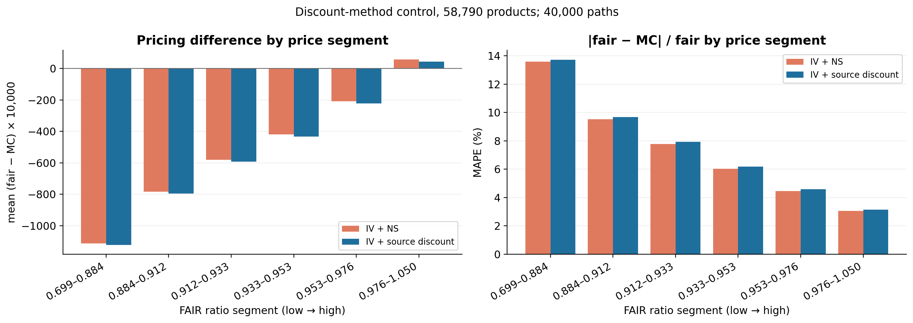

## 두 지급 구현과 합성 계약

- `reference`: 원본의 균등 평가일·평가일 할인·미낙인 만기 원금 지급·월지급형 누적 쿠폰 근사.
- `detailed`: 기존 보완 구현의 명시적 평가/지급일·만기 생존 쿠폰·월 쿠폰 현금흐름.
- 두 구현에 같은 기준·변경 계약, 같은 IV·상관·금리, 같은 경로를 사용했다. 구현 차이 자체의 paired MC 표준오차도 계산했다.
- 기준 계약 2,652개와 88,181개 시나리오. 기존 2,048/256/256 학습·검증·시험 계약 분할 및 92개 진단 계약을 유지했다. 계약 템플릿 분할은 기존 것을 유지했으며 시장 상태까지 독립적으로 분할한 실험은 아니다.
- 쿠폰·KI·1차/만기 행사가·월 쿠폰 배리어를 여러 양/음 변경 폭으로 평가했다. 관측 추가와 만기 변경은 기존 명시된 일정 규칙을 적용한 평가 축이며 학습에는 넣지 않았다.

**원본 근사에서 월 쿠폰 배리어와 개별 지급일은 가격 입력으로 사용되지 않는다.** 따라서 이 축의 원본 증분이 0인 것은 모델이 월 쿠폰을 정확하게 구현했다는 증거가 아니다. 관측 횟수가 바뀌면 원본은 모든 평가일을 다시 균등 배치하므로 상세 구현의 평가일 한 개 삽입과 표현 방식도 다르다.

## 조건별 평균 MC 증분

일반형·월지급형 시험 계약 각각 128개에서 계산한 평균이며 단위는 원이다. KI 변경은 KI 계약만 포함한다. 아래 구현 간 차이는 **상세 구현의 증분 − 원본 근사의 증분**이다. 계약별 최소·최대와 구조별 결과는 CSV에 별도로 저장했다.

| 상품 | 변경 | 계약수 | 원본 근사 ΔMC | 상세 지급 ΔMC | 차이: 상세−원본 |
| --- | --- | --- | --- | --- | --- |
| 일반형 | 1차 행사가 +5%p | 128 | -13.10 | -8.29 | 4.81 |
| 일반형 | 낙인 배리어 +5%p | 64 | -39.50 | -50.25 | -10.75 |
| 일반형 | 만기 행사가 +5%p | 128 | -44.15 | -30.29 | 13.87 |
| 일반형 | 연 쿠폰 +1%p | 128 | 53.73 | 55.55 | 1.82 |
| 월지급형 | 1차 행사가 +5%p | 128 | -44.53 | 2.84 | 47.37 |
| 월지급형 | 낙인 배리어 +5%p | 43 | -103.00 | -102.03 | 0.97 |
| 월지급형 | 만기 행사가 +5%p | 128 | -50.08 | -25.91 | 24.17 |
| 월지급형 | 연 쿠폰 +1%p | 128 | 70.06 | 93.70 | 23.64 |
| 월지급형 | 월 쿠폰 배리어 +5%p | 128 | 0.00 | -35.53 | -35.53 |

### 관측 횟수·만기 변경 규칙과 결과

관측 +1회는 첫 평가 전·중간 구간·마지막 구간의 중간 날짜에 추가한다. 중간·마지막의 추가 행사가와 쿠폰 누적기간은 양옆 조건을 선형 보간하고, 첫 평가 전은 첫 행사가를 유지한다. 추가 Lizard 조건은 두지 않는다. 상세 구현은 기존 날짜를 유지하지만 원본 근사에서는 전체 관측 날짜를 다시 균등 배치한다. 입력 슬롯이 12개인 계약은 추가 관측 실험에서 제외되어 일반형은 81개다.

만기는 ±1/3/6/12개월 변경한다. 조기상환 평가일과 일반형 쿠폰 누적기간은 새 만기 비율로 조정한다. 월지급형은 기존 월별 지급을 유지하고, 연장 시 월 지급을 추가하며 단축 시 만기 이후 지급을 제거하고 마지막 짧은 기간의 쿠폰을 비례 계산한다. 월지급형은 저장된 영업일·지급 지연 규칙을 적용하고 일반 합성 계약은 달력 일수 규칙을 쓴다. 따라서 이 두 축은 부수 일정까지 명시해 변경한 계약의 효과다.

| 상품 | 변경 | 계약수 | 원본 근사 ΔMC | 상세 지급 ΔMC | 차이: 상세−원본 |
| --- | --- | --- | --- | --- | --- |
| 일반형 | 관측 +1회: 마지막 구간 | 81 | 63.84 | 2.00 | -61.85 |
| 일반형 | 관측 +1회: 중간 | 81 | 43.51 | 2.32 | -41.19 |
| 일반형 | 관측 +1회: 첫 평가 전 | 81 | -86.05 | 12.09 | 98.13 |
| 일반형 | 만기 변경 +12개월 | 128 | -74.09 | -50.40 | 23.69 |
| 일반형 | 만기 변경 +1개월 | 128 | -6.25 | -4.07 | 2.18 |
| 일반형 | 만기 변경 +3개월 | 128 | -18.65 | -12.43 | 6.23 |
| 일반형 | 만기 변경 +6개월 | 128 | -37.43 | -24.95 | 12.48 |
| 일반형 | 만기 변경 -12개월 | 128 | 74.44 | 47.69 | -26.75 |
| 일반형 | 만기 변경 -1개월 | 128 | 6.02 | 4.01 | -2.01 |
| 일반형 | 만기 변경 -3개월 | 128 | 18.45 | 12.38 | -6.07 |
| 일반형 | 만기 변경 -6개월 | 128 | 37.61 | 24.73 | -12.88 |
| 월지급형 | 관측 +1회: 마지막 구간 | 128 | 28.95 | 2.58 | -26.36 |
| 월지급형 | 관측 +1회: 중간 | 128 | 10.77 | 0.37 | -10.40 |
| 월지급형 | 관측 +1회: 첫 평가 전 | 128 | 12.55 | -49.88 | -62.43 |
| 월지급형 | 만기 변경 +12개월 | 128 | -80.62 | -33.68 | 46.94 |
| 월지급형 | 만기 변경 +1개월 | 128 | -7.75 | -10.89 | -3.14 |
| 월지급형 | 만기 변경 +3개월 | 128 | -22.29 | -23.16 | -0.86 |
| 월지급형 | 만기 변경 +6개월 | 128 | -42.91 | -16.72 | 26.19 |
| 월지급형 | 만기 변경 -12개월 | 128 | 98.61 | 18.69 | -79.93 |
| 월지급형 | 만기 변경 -1개월 | 128 | 7.78 | -31.90 | -39.68 |
| 월지급형 | 만기 변경 -3개월 | 128 | 23.12 | -16.23 | -39.36 |
| 월지급형 | 만기 변경 -6개월 | 128 | 47.49 | 3.49 | -44.00 |

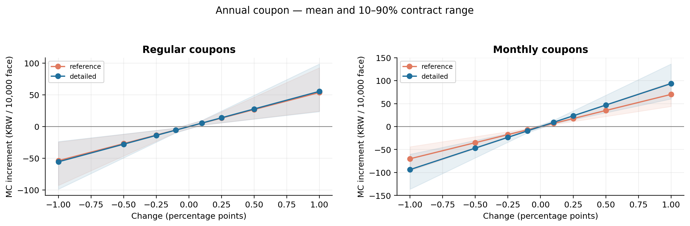
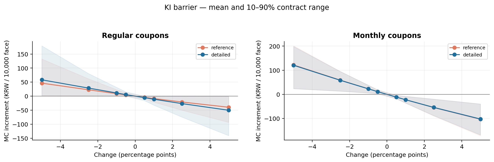
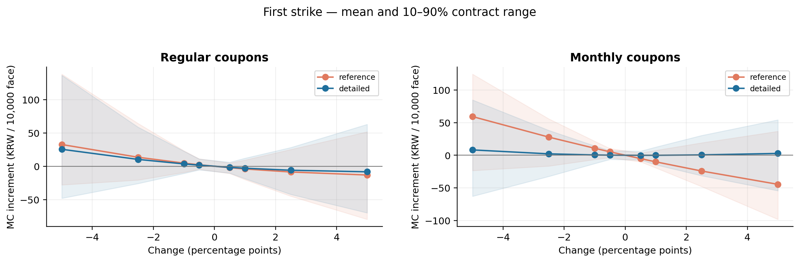
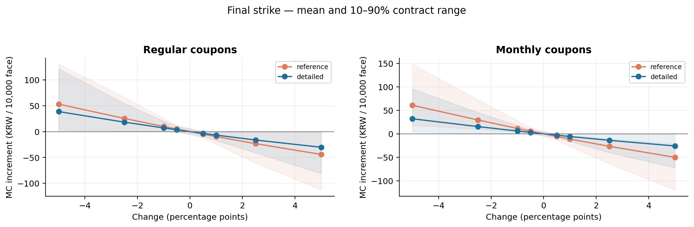
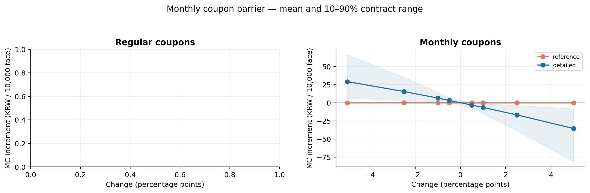
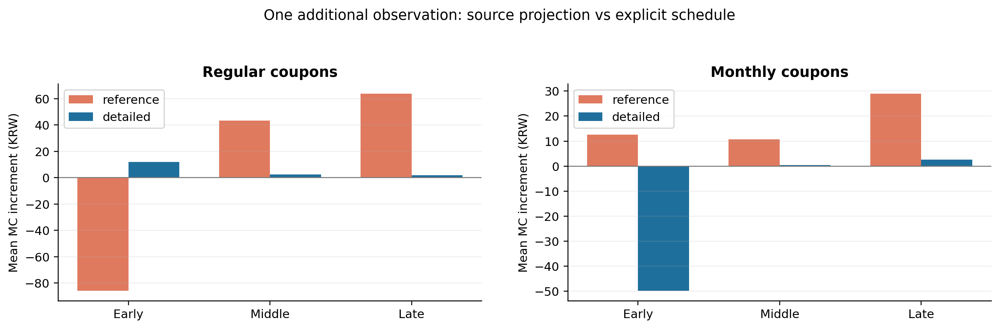
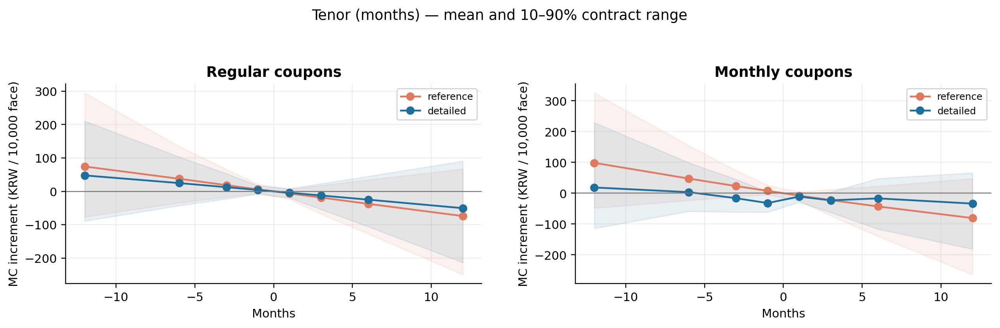
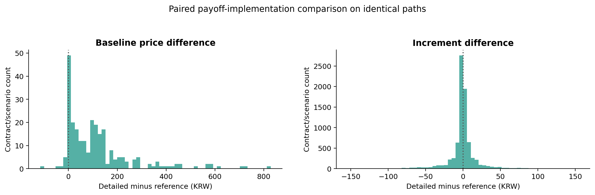

## MC 수치 안정성

| payoff | axis | 변경 시나리오수 | 2만→4만 평균 절대변화(원) | 절대변화 95백분위(원) | 4만×3시드 증분 SE 평균(원) |
| --- | --- | --- | --- | --- | --- |
| detailed | coupon_regular | 2048 | 0.06 | 0.23 | 0.08 |
| detailed | first_strike | 2048 | 0.64 | 2.42 | 0.79 |
| detailed | ki_barrier | 856 | 0.75 | 2.76 | 0.92 |
| detailed | last_strike | 2048 | 0.40 | 1.46 | 0.52 |
| detailed | monthly_barrier | 1004 | 0.11 | 0.38 | 0.13 |
| detailed | nobs_early | 209 | 1.42 | 4.51 | 1.73 |
| detailed | nobs_late | 209 | 0.21 | 0.84 | 0.28 |
| detailed | nobs_middle | 209 | 0.28 | 0.97 | 0.34 |
| detailed | tenor_months | 2048 | 1.66 | 5.44 | 2.10 |
| detailed_minus_reference | coupon_regular | 2048 | 0.05 | 0.19 | 0.07 |
| detailed_minus_reference | first_strike | 2048 | 0.66 | 2.37 | 0.86 |
| detailed_minus_reference | ki_barrier | 856 | 0.35 | 1.14 | 0.44 |
| detailed_minus_reference | last_strike | 2048 | 0.48 | 1.59 | 0.63 |
| detailed_minus_reference | monthly_barrier | 1004 | 0.11 | 0.38 | 0.13 |
| detailed_minus_reference | nobs_early | 209 | 2.04 | 6.21 | 2.53 |
| detailed_minus_reference | nobs_late | 209 | 1.46 | 4.66 | 2.02 |
| detailed_minus_reference | nobs_middle | 209 | 1.39 | 4.78 | 1.96 |
| detailed_minus_reference | tenor_months | 2048 | 1.35 | 4.15 | 1.80 |
| reference | coupon_regular | 2048 | 0.06 | 0.23 | 0.08 |
| reference | first_strike | 2048 | 0.71 | 2.45 | 0.91 |
| reference | ki_barrier | 856 | 0.67 | 2.25 | 0.82 |
| reference | last_strike | 2048 | 0.57 | 1.89 | 0.76 |
| reference | monthly_barrier | 1004 | 0.00 | 0.00 | 0.00 |
| reference | nobs_early | 209 | 1.50 | 4.64 | 2.09 |
| reference | nobs_late | 209 | 1.44 | 4.26 | 2.02 |
| reference | nobs_middle | 209 | 1.36 | 4.10 | 1.96 |
| reference | tenor_months | 2048 | 1.92 | 6.14 | 2.50 |

표의 MC 오차와 2만→4만 경로 변화는 가격 계산의 수치 안정성을 뜻한다. DeepONet 예측 오차와는 다른 지표다. 각 시드별 평균 증분은 `results/mc_effect_by_seed.csv`에 저장했다.

## DeepONet 학습·평가

각 지급 구현의 MC 라벨로 가격 손실 / 가격+증분 손실 / 가격+증분 손실+쿠폰 선형 구조를 각각 학습했다. 방식당 3시드, 총 18개 모델이다. 모든 모델은 기존 고정 하이퍼파라미터를 사용했고 검증 점수로 선택한 뒤 시험했다. PI 손실과 Stage 2는 사용하지 않았다.

선택 방식: `reference` → `augmented_delta`, `detailed` → `augmented_delta`.

가격 지표는 기준·변경 가격 전체, 증분 지표는 변경 시나리오로 계산했다. `terms`는 쿠폰·KI·행사가·월 쿠폰 배리어, `schedule`은 관측 추가·만기 변경이다. 아래 결과는 각 방식의 3개 학습 시드 평균 예측이다. 별도 기준 계약 가격 지표는 `model_baseline_metrics.csv`에 있다.

| 구현 | 시험군 | 범위 | 학습 방식 | 가격 R² | 가격 MAE(원) | 증분 MAE(원) | 방향 일치율(%) | 1원 이내(%) | 5원 이내(%) | 10원 이내(%) |
| --- | --- | --- | --- | --- | --- | --- | --- | --- | --- | --- |
| reference | monthly_test | schedule | affine_coupon_delta | 0.4443 | 249.56 | 254.60 | 56.77 | 0.07 | 0.57 | 1.21 |
| reference | monthly_test | terms | affine_coupon_delta | 0.9921 | 32.01 | 9.17 | 90.15 | 23.39 | 61.81 | 77.87 |
| reference | monthly_test | schedule | augmented_delta | 0.1009 | 335.27 | 333.91 | 58.83 | 0.21 | 2.20 | 4.05 |
| reference | monthly_test | terms | augmented_delta | 0.9568 | 65.11 | 10.84 | 89.47 | 21.67 | 56.40 | 73.08 |
| reference | monthly_test | schedule | augmented_price | 0.3841 | 276.64 | 278.75 | 55.42 | 0.07 | 1.49 | 2.56 |
| reference | monthly_test | terms | augmented_price | 0.9586 | 69.65 | 14.61 | 87.25 | 9.43 | 41.47 | 58.85 |
| reference | monthly_test | schedule | prior_frozen_affine_coupon_delta | 0.5456 | 238.25 | 187.30 | 55.34 | 0.50 | 2.06 | 8.95 |
| reference | monthly_test | terms | prior_frozen_affine_coupon_delta | 0.7081 | 175.94 | 17.13 | 85.74 | 8.98 | 39.34 | 56.63 |
| reference | regular_test | schedule | affine_coupon_delta | 0.7916 | 132.63 | 114.01 | 55.58 | 2.60 | 11.37 | 20.36 |
| reference | regular_test | terms | affine_coupon_delta | 0.9801 | 48.36 | 7.36 | 94.70 | 23.88 | 62.78 | 78.68 |
| reference | regular_test | schedule | augmented_delta | 0.8087 | 129.54 | 108.73 | 59.79 | 3.24 | 14.92 | 23.44 |
| reference | regular_test | terms | augmented_delta | 0.9760 | 50.84 | 6.97 | 94.46 | 25.56 | 64.51 | 80.36 |
| reference | regular_test | schedule | augmented_price | 0.8398 | 124.76 | 97.39 | 63.92 | 3.71 | 14.92 | 23.68 |
| reference | regular_test | terms | augmented_price | 0.9716 | 57.47 | 8.81 | 93.10 | 21.37 | 59.54 | 76.00 |
| reference | regular_test | schedule | prior_frozen_affine_coupon_delta | 0.7219 | 187.46 | 122.19 | 59.88 | 1.74 | 9.08 | 17.36 |
| reference | regular_test | terms | prior_frozen_affine_coupon_delta | 0.8612 | 125.56 | 11.28 | 93.34 | 18.25 | 53.10 | 69.81 |
| detailed | monthly_test | schedule | affine_coupon_delta | 0.6604 | 187.28 | 173.76 | 57.14 | 0.78 | 2.77 | 5.11 |
| detailed | monthly_test | terms | affine_coupon_delta | 0.9674 | 61.35 | 8.49 | 97.92 | 20.54 | 56.15 | 73.24 |
| detailed | monthly_test | schedule | augmented_delta | 0.6363 | 203.15 | 195.32 | 54.70 | 0.00 | 1.56 | 3.27 |
| detailed | monthly_test | terms | augmented_delta | 0.9730 | 55.01 | 9.16 | 89.82 | 13.69 | 52.08 | 71.54 |
| detailed | monthly_test | schedule | augmented_price | 0.7537 | 169.60 | 160.80 | 55.44 | 0.36 | 2.70 | 4.76 |
| detailed | monthly_test | terms | augmented_price | 0.9700 | 50.48 | 11.90 | 89.51 | 10.41 | 44.50 | 64.82 |
| detailed | monthly_test | schedule | prior_frozen_affine_coupon_delta | 0.4660 | 237.69 | 203.09 | 54.03 | 0.43 | 1.56 | 3.62 |
| detailed | monthly_test | terms | prior_frozen_affine_coupon_delta | 0.9171 | 100.90 | 7.90 | 98.48 | 22.92 | 58.87 | 75.16 |
| detailed | regular_test | schedule | affine_coupon_delta | 0.8813 | 104.16 | 82.20 | 63.24 | 3.87 | 12.15 | 21.23 |
| detailed | regular_test | terms | affine_coupon_delta | 0.9754 | 54.15 | 9.12 | 93.62 | 21.76 | 59.29 | 75.42 |
| detailed | regular_test | schedule | augmented_delta | 0.9127 | 92.43 | 64.15 | 70.93 | 2.92 | 15.79 | 28.41 |
| detailed | regular_test | terms | augmented_delta | 0.9694 | 60.32 | 9.07 | 93.15 | 22.10 | 59.01 | 75.64 |
| detailed | regular_test | schedule | augmented_price | 0.9203 | 92.89 | 51.81 | 69.64 | 5.45 | 19.73 | 33.15 |
| detailed | regular_test | terms | augmented_price | 0.9532 | 73.96 | 11.07 | 91.14 | 18.83 | 54.83 | 71.12 |
| detailed | regular_test | schedule | prior_frozen_affine_coupon_delta | 0.7668 | 161.21 | 120.10 | 60.73 | 1.03 | 7.02 | 14.21 |
| detailed | regular_test | terms | prior_frozen_affine_coupon_delta | 0.9152 | 100.25 | 11.01 | 92.28 | 18.78 | 53.54 | 70.56 |

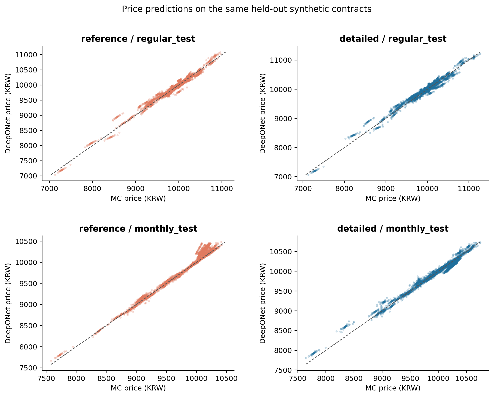
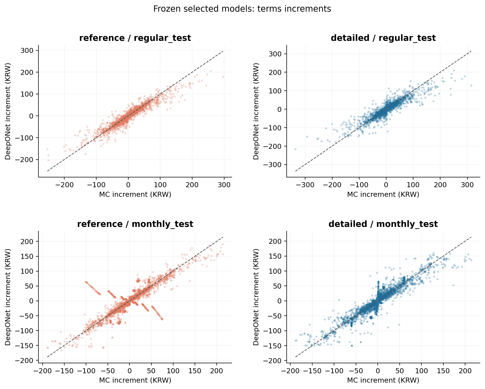
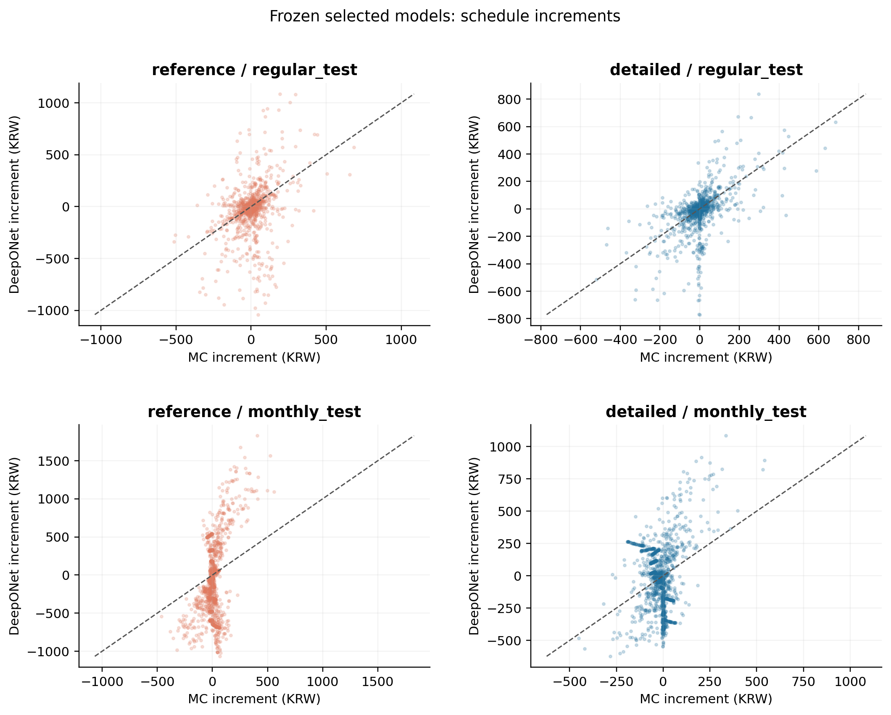

선택 모델의 MC로 구분 가능한 방향 실패는 시험·진단을 합쳐 **3,359개 시나리오**다. 분모와 상품·축별 지표는 `model_metrics.csv`, 개별 실패는 `resolved_direction_failures.csv.gz`에 있다. 이 수만으로 모든 조건에서 안정적이라고 판정하지 않는다.

방향 평가는 |ΔMC| > 1.96×paired MC SE이면서 영향 경로가 30개 이상인 경우만 사용했다. 1/5/10원 이내 비율은 오차 분포를 보기 위한 진단값이다. 시드·상품·변경 폭별 오차와 일정 변경 실패를 함께 확인해야 한다.

기존 동결 모델과의 차이에는 IV·곡선·학습 라벨 변경과 재학습 효과가 함께 들어간다. 같은 라벨 내 학습 방식 비교만 손실·구조 변경에 대한 통제 비교이며, 새 자료 효과를 독립적으로 식별한 실험은 아니다. 기존 시험 계약을 다시 사용하므로 완전히 새로운 독립 시험이라고 부르지 않는다.

### 평균 오차의 개선과 남은 실패

- `reference` / regular_test: 가격만 학습한 모델 → 선택 모델의 계약조건 증분 MAE **8.81 → 6.97원**. 선택 모델의 가격 R² **0.9760**, 방향 일치율 **94.46%**. 관측·만기 변경의 증분 MAE는 **108.73원**이다.
- `reference` / monthly_test: 가격만 학습한 모델 → 선택 모델의 계약조건 증분 MAE **14.61 → 10.84원**. 선택 모델의 가격 R² **0.9568**, 방향 일치율 **89.47%**. 관측·만기 변경의 증분 MAE는 **333.91원**이다.
- `detailed` / regular_test: 가격만 학습한 모델 → 선택 모델의 계약조건 증분 MAE **11.07 → 9.07원**. 선택 모델의 가격 R² **0.9694**, 방향 일치율 **93.15%**. 관측·만기 변경의 증분 MAE는 **64.15원**이다.
- `detailed` / monthly_test: 가격만 학습한 모델 → 선택 모델의 계약조건 증분 MAE **11.90 → 9.16원**. 선택 모델의 가격 R² **0.9730**, 방향 일치율 **89.82%**. 관측·만기 변경의 증분 MAE는 **195.32원**이다.

검증 점수로 선택한 방식이 모든 시험 축의 최소 오차를 보장하지 않는다. 이 실험에서 계약조건 증분의 평균 오차는 감소했으나 방향 불일치와 일정 변경 오차가 남았으므로, **모든 상품·변경 폭에서 가격 증분을 안정적으로 예측한다고 결론 내릴 수 없다.** 지급 구현을 상세화하는 것과 그 라벨을 DeepONet이 잘 근사하는 것은 각각 확인해야 한다.

선택 방식의 계약조건·변경 폭별 결과는 `model_selected_axis.csv`와 각 구현의 `metrics_by_offset.csv`, 학습 시드별 결과는 `model_seed_summary.csv`, 구조별 결과는 `model_metrics_by_structure.csv`에 있다. 아래 95% bootstrap 구간은 계약별 평균 증분 오차 차이를 구하고 각 계약에 같은 가중치를 주어 계산했다. 따라서 변경 시나리오에 같은 가중치를 주는 위 전체 MAE 차이와는 조금 다를 수 있다. 음수는 선택 방식의 오차가 더 작다는 뜻이다.

| payoff | cohort | selected | comparator | mean_difference | ci_low | ci_high |
| --- | --- | --- | --- | --- | --- | --- |
| reference | regular_test | augmented_delta | augmented_price | -1.95 | -2.43 | -1.50 |
| reference | regular_test | augmented_delta | affine_coupon_delta | -0.41 | -0.85 | -0.01 |
| reference | regular_test | augmented_delta | prior_frozen_affine_coupon_delta | -4.01 | -5.17 | -2.88 |
| reference | monthly_test | augmented_delta | augmented_price | -3.67 | -4.23 | -3.11 |
| reference | monthly_test | augmented_delta | affine_coupon_delta | 1.83 | 1.25 | 2.40 |
| reference | monthly_test | augmented_delta | prior_frozen_affine_coupon_delta | -5.83 | -7.38 | -4.27 |
| detailed | regular_test | augmented_delta | augmented_price | -2.01 | -2.58 | -1.44 |
| detailed | regular_test | augmented_delta | affine_coupon_delta | -0.05 | -0.47 | 0.38 |
| detailed | regular_test | augmented_delta | prior_frozen_affine_coupon_delta | -1.51 | -2.62 | -0.44 |
| detailed | monthly_test | augmented_delta | augmented_price | -2.71 | -3.06 | -2.37 |
| detailed | monthly_test | augmented_delta | affine_coupon_delta | 0.68 | 0.38 | 0.98 |
| detailed | monthly_test | augmented_delta | prior_frozen_affine_coupon_delta | 1.20 | 0.53 | 1.85 |

## 재현 파일

`prepare.py` → `run_population.py` → `plot.py --fresh`; `synthetic.py prepare` → `synthetic.py verify` → `synthetic.py run` → `learn.py train` → `learn.py evaluate` → `report.py`. 원본 입력·코드 해시는 `source_manifest.json`, MC 설정은 `protocol.json`, 실행 로그·완료 표시는 `results/`에 있다. 저장 결과가 있으면 plot/report만 실행하며 MC를 반복하지 않는다.

원본 폴더는 읽어서 복사만 했으며 계산과 결과 저장은 이 branch에서 수행했다. 이 비교는 정의된 GBM·지급 구현의 MC 반사실 실험이다. 모든 실제 상품 약관의 정확성이나 관측 공정가의 인과효과를 검증한 결과는 아니다.
