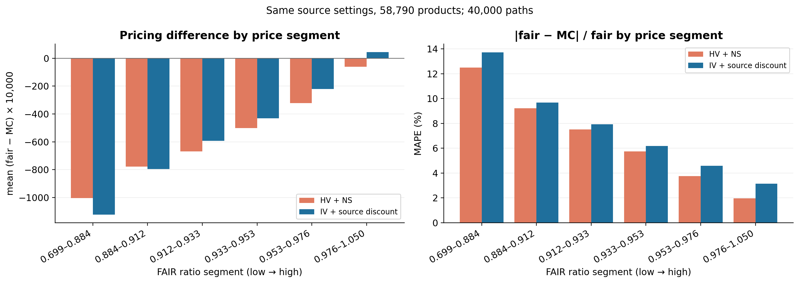

## 발표 기준 재현과 두 지급 구현 비교 (2026-09-15)

발표 그림을 만든 원본 코드·저장 표본·시장 입력을 확인해 별도 실험으로 재현했다. 기존 main과 앞선 IV 실험은 보존했다. 학습 타깃은 MC 이론가이며 Stage 2는 사용하지 않았다.

- 원본 그림의 표본은 앞부분 23,151개, 이후 HV·IV 비교 58,790개였다. 저장 가격을 재집계해 평균 차이 −507원 및 HV −556원 / IV −520원을 확인했다.
- 제공된 ATM IV CSV 2,404개가 원본에서 사용한 파일과 모두 일치했다. 같은 58,790개 상품에서 원본 지급 근사로 HV·IV 가격을 4만 경로 재계산했다.
- 기준 계약 2,652개·기준 및 변경 시나리오 88,181개에서 원본 근사와 상세 지급 구현을 같은 시장 입력·경로로 비교했다. 합성 학습·검증은 4만 경로×1시드, 시험·진단은 4만 경로×3시드다.
- 두 지급 구현 각각 가격 손실 / 가격+증분 손실 / 가격+증분 손실+쿠폰 선형 구조를 3시드로 학습해 총 18개 DeepONet을 평가했다.

### 실제 상품 58,790개 재계산

| MC 설정 | 평균 FAIR−MC | MAE | MAPE |
|---|---:|---:|---:|
| HV + NS | -556.06 | 613.66 | 6.78% |
| IV + source discount | -520.11 | 684.05 | 7.54% |
| IV + NS | -507.47 | 671.91 | 7.41% |

위 차이는 원본 그림의 정규화 식 `(FAIR/발행가 − 단위 액면 MC)×10,000`을 재현한 값이다. 발행가와 액면가가 다른 경우 완전히 같은 금액 기준은 아니다. 원본 IV 그림의 할인 구현은 세 금리점의 선형 제로금리 보간이며, IV+NS 대조군을 추가했다.

### 동일 합성 계약의 평균 MC 증분

| 상품 | 변경 | 원본 지급 근사 | 상세 지급 구현 |
|---|---|---:|---:|
| 일반형 | 1차 행사가 +5%p | -13.10원 | -8.29원 |
| 일반형 | 낙인 배리어 +5%p | -39.50원 | -50.25원 |
| 일반형 | 만기 행사가 +5%p | -44.15원 | -30.29원 |
| 일반형 | 연 쿠폰 +1%p | +53.73원 | +55.55원 |
| 월지급형 | 1차 행사가 +5%p | -44.53원 | +2.84원 |
| 월지급형 | 낙인 배리어 +5%p | -103.00원 | -102.03원 |
| 월지급형 | 만기 행사가 +5%p | -50.08원 | -25.91원 |
| 월지급형 | 연 쿠폰 +1%p | +70.06원 | +93.70원 |
| 월지급형 | 월 쿠폰 배리어 +5%p | +0.00원 | -35.53원 |

### 선택 DeepONet의 시험 성능

검증 점수에 따른 선택: 원본 지급 근사 `augmented_delta`, 상세 지급 구현 `augmented_delta`. 가격·증분 지표는 쿠폰·배리어·행사가 변경 시험에 대한 3개 학습 시드 평균 예측이다.

| 지급 구현 | 상품 | 가격 R² | 가격 MAE | 증분 MAE: 가격만 학습→선택 모델 | 방향 일치율 | 일정 변경 증분 MAE |
|---|---|---:|---:|---:|---:|---:|
| 원본 지급 근사 | 일반형 | 0.9760 | 50.84원 | 8.81→6.97원 | 94.46% | 108.73원 |
| 원본 지급 근사 | 월지급형 | 0.9568 | 65.11원 | 14.61→10.84원 | 89.47% | 333.91원 |
| 상세 지급 구현 | 일반형 | 0.9694 | 60.32원 | 11.07→9.07원 | 93.15% | 64.15원 |
| 상세 지급 구현 | 월지급형 | 0.9730 | 55.01원 | 11.90→9.16원 | 89.82% | 195.32원 |

계약조건 증분의 평균 오차는 감소했지만 방향 불일치와 관측 횟수·만기 변경의 큰 오차가 남았다. 모든 상품·변경 폭에서 증분을 안정적으로 예측한다고 결론 내릴 수 없다. 원본 근사에서는 월 쿠폰 배리어가 가격에 반영되지 않으므로 해당 MC 증분 0원을 정확한 월지급 구현의 결과로 해석하지 않는다.

전체 설정·표·민감도·예측 그림은 [실험 보고서](REPORT.md), 데이터부터 다시 실행하거나 저장된 결과로 그림만 만드는 방법은 [실행 안내](EXECUTION.md)에 있다.
